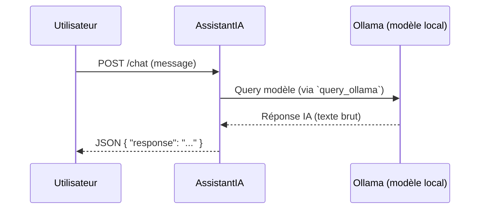

# 🚀 API FastAPI — Arkalia-LUNA

L'API FastAPI permet à des agents externes, humains ou systèmes, de communiquer avec Arkalia-LUNA de manière **locale, modulaire et sécurisée**.

---

## 🌐 Endpoint principal

- **URL locale** : `http://127.0.0.1:8000/`
- **Serveur** : `Uvicorn` (via Docker ou en local)
- **Point d'entrée** : `helloria.core:app`

### ▶️ Commande de démarrage manuelle

```bash
uvicorn helloria.core:app --reload

💡 Alternativement, utiliser docker-compose up ou le script ark-docker.

Méthode
URL
Description
GET
/
Test de vie : "Bienvenue dans Helloria"
POST
/chat
Envoie un prompt à l'IA locale (assistantia)
GET
/status
Retourne l'état général du système
GET
/echo?msg=x
Répond avec le message donné


⸻

🔐 Sécurité & accès
	•	API uniquement exposée en local
	•	Possibilité future d'ajouter :
	•	Authentification par clé
	•	Rate limiting
	•	Journalisation des accès via reflexia

⸻

📦 Design modulaire

Chaque endpoint est délégué à un module :
	•	helloria/ = orchestration API
	•	assistantia/ = génération IA
	•	reflexia/ = métriques & diagnostics
	•	nyxalia/ = interprétation mobile

⸻

✅ Architecture pensée pour l'extensibilité et le contrôle par module.

# 📌 Arkalia-LUNA Documentation Technique

## Version Actuelle

**v2.0.2 — 20 juin 2025**
🔄 Git tag synchronisé, CI/CD active, Docker stable, tests validés à 100 %

## 🧠 Modules IA Actifs

| Module      | Rôle                                | État       |
|-------------|-------------------------------------|------------|
| assistantia | IA contextuelle via /chat + Ollama  | ✅ Stable  |
| helloria    | Serveur d'entrée FastAPI            | ✅ Stable  |
| reflexia    | Superviseur cognitif & metrics      | ✅ Stable  |
| nyxalia     | Interface cognitive mobile          | ✅ Stable  |

## 🚀 API Active

**POST /chat — AssistantIA**

Utilisation : envoie un message à l'IA locale (Ollama mistral)

**Requête :**

```json
{
  "message": "Bonjour Arkalia"
}
```

**Réponse :**

```json
{
  "réponse": "Bonjour ! Je suis AssistantIA, prêt à vous aider."
}
```

**Erreurs gérées :**

| Cas               | Statut | Message retourné            |
|-------------------|--------|-----------------------------|
| Body vide         | 422    | Champ message requis        |
| Prompt vide       | 200    | [⚠️ Réponse IA vide]        |
| Modèle non supporté | 500  | ValueError levée            |
| Timeout Ollama    | 500    | [Erreur IA] ReadTimeout     |

## 🧪 Tests & Couverture

- ✅ 35/35 tests passés
- ✅ Couverture : 92 %
- ✅ Modules testés : assistantia, ollama_connector, helloria, reflexia, nyxalia, hooks, scripts

## 🐳 Environnement Docker

- Conteneur stable (ark-docker)
- Ollama local requis (mistral, tinyllama)
- FastAPI exposé sur localhost:8000

## 📘 Site public MkDocs

Disponible ici : arkalia-luna-pro GitHub Pages
Sitemap automatique, Mermaid, thème personnalisé Bleu Coton Nuit, badge coverage 92 %.

---

## 🧭 Prochaine étape : Arkalia LUNA Nexus — interface IA guidée, cognitive, et adaptative.

## 📊 Flux de Communication — /chat



## 📚 Cas d'Usage

### Poser une Question
Envoyez une requête POST à `/chat` avec votre question pour obtenir une réponse contextuelle de l'IA.

### Mode Debug
Utilisez le paramètre `debug=true` pour obtenir des informations détaillées sur le traitement de la requête.

## ⚠️ Erreurs Typiques

| Erreur               | Cause Possible                  | Correction Suggestée            |
|----------------------|---------------------------------|---------------------------------|
| Body vide            | Requête sans champ `message`    | Ajouter un champ `message`      |
| Prompt vide          | Champ `message` vide            | Fournir un texte dans `message` |
| Modèle non supporté  | Modèle IA non disponible        | Vérifier la configuration du modèle |
| Timeout Ollama       | Temps d'attente dépassé         | Vérifier la connexion et les ressources |

Pour plus de détails sur l'AssistantIA, consultez [AssistantIA](assistantia.md).

### POST /chat

- **Body :** `{ "message": str }`
- **Réponses :**
  - `200` → `{ "réponse": str }`
  - `400` → `{ "detail": "Message vide." }`
  - `422` → validation automatique si champ manquant

## 🧠 Module `reflexia` — Analyse cognitive réflexive

Reflexia est le module d'observation et d'auto-analyse du système Arkalia.
Il lit des métriques internes (CPU, mémoire, etc.), évalue leur criticité, et peut sauvegarder un état réflexif.

### 🔹 Fonctions exposées :

| Fonction | Description |
|---------|-------------|
| `launch_reflexia_check()` | Lance un scan réflexif et retourne un dictionnaire contenant le statut du système. |

### 🔬 Exemple de retour :

```json
{
  "status": "normal"
}

Dossiers :
  •  reflexia/core.py : fonction principale
  •  reflexia/logic/*.py : analyse CPU, snapshot JSON, décisions
  •  reflexia/tests/unit/ : 5 fichiers de test, tous validés
```

### 🧠 ReflexIA — Vérification réflexive instantanée

- 🔍 Description : Analyse réflexive instantanée — récupère les métriques système, les évalue, et retourne un diagnostic.
- 📂 Module : modules/reflexia/
- ⚙️ Fonction appelée : launch_reflexia_check()

🔄 Exemple de réponse :
```json
{
  "status": "ok",
  "metrics": {
    "cpu": 72.5,
    "ram": 61.8,
    "latency": 145
  }
}
```

```bash
curl http://localhost:8000/reflexia/check | jq
