# Architecture Arkalia-LUNA Pro

## Vue d'ensemble

Arkalia-LUNA Pro est un système d'intelligence artificielle modulaire et évolutif, conçu selon les principes SOLID et optimisé pour la production.

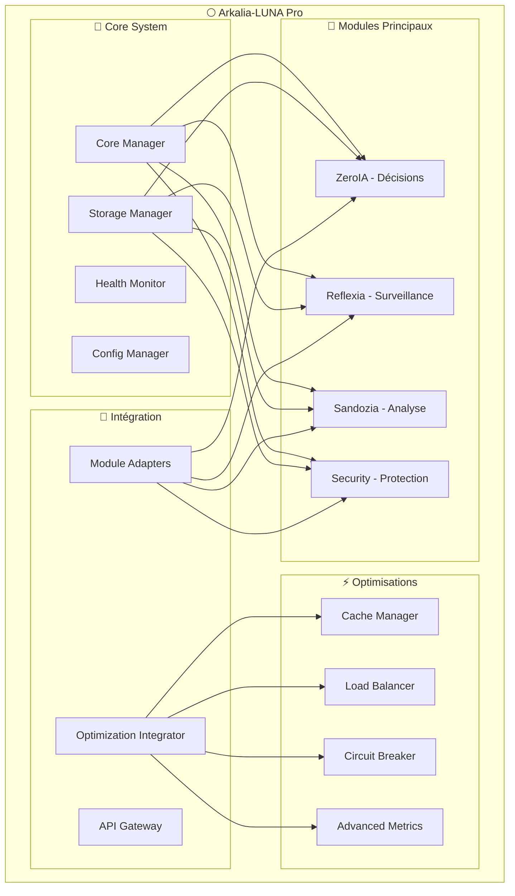

## Architecture Modulaire

### 1. Core System

Le système central gère l'orchestration, le stockage, la santé et la configuration.

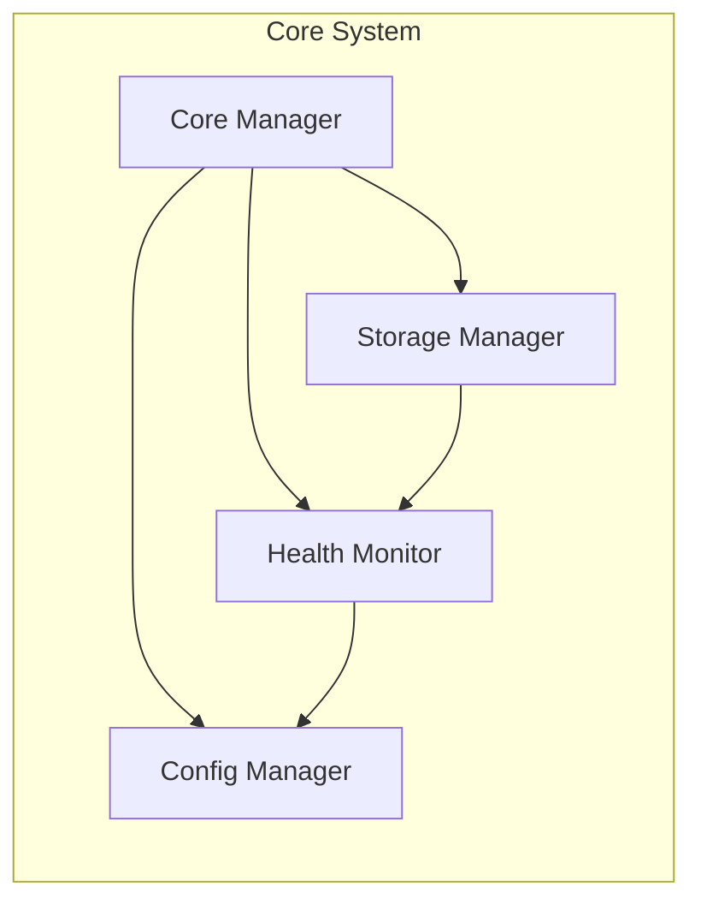

**Composants :**
- **Core Manager** : Orchestrateur principal
- **Storage Manager** : Abstraction de stockage (JSON/SQLite)
- **Health Monitor** : Surveillance de santé système
- **Config Manager** : Gestion de configuration centralisée

### 2. Modules Principaux

#### ZeroIA - Système de Décision

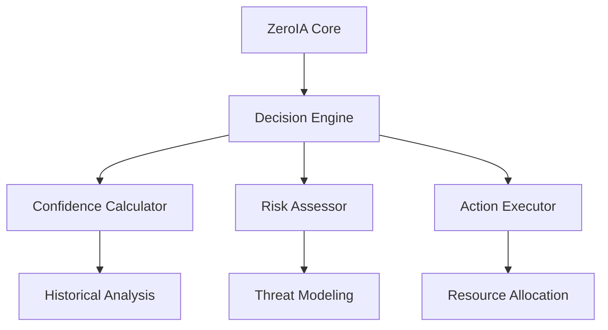

**Fonctionnalités :**
- Prise de décision basée sur la confiance
- Évaluation des risques
- Allocation dynamique des ressources
- Apprentissage adaptatif

#### Reflexia - Système de Surveillance

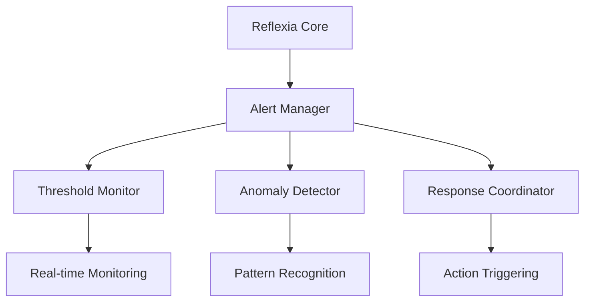

**Fonctionnalités :**
- Surveillance en temps réel
- Détection d'anomalies
- Gestion des alertes
- Coordination des réponses

#### Sandozia - Système d'Analyse

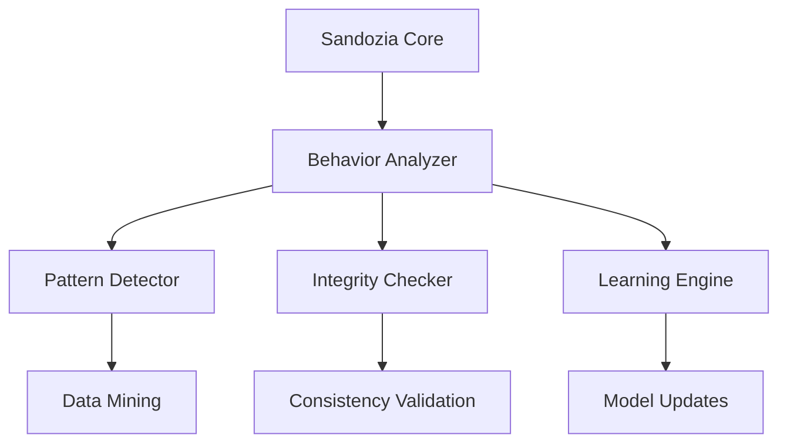

**Fonctionnalités :**
- Analyse comportementale
- Détection de patterns
- Vérification d'intégrité
- Apprentissage continu

#### Security - Système de Sécurité

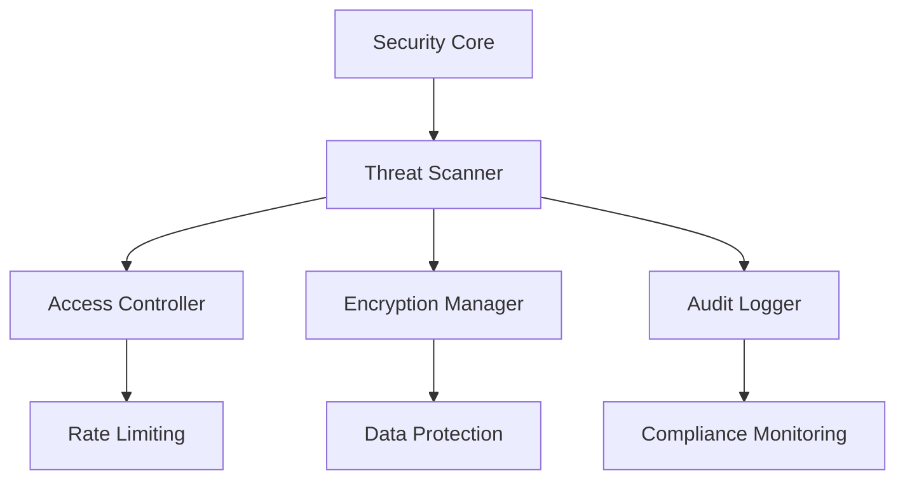

**Fonctionnalités :**
- Scan de menaces
- Contrôle d'accès
- Chiffrement des données
- Audit et conformité

### 3. Système d'Optimisation

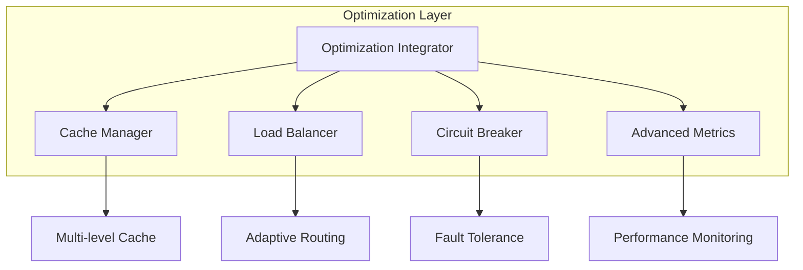

**Composants :**
- **Cache Manager** : Cache intelligent multi-niveaux
- **Load Balancer** : Équilibrage de charge adaptatif
- **Circuit Breaker** : Protection contre les pannes
- **Advanced Metrics** : Métriques et alertes avancées

## Flux de Données

### Flux Principal

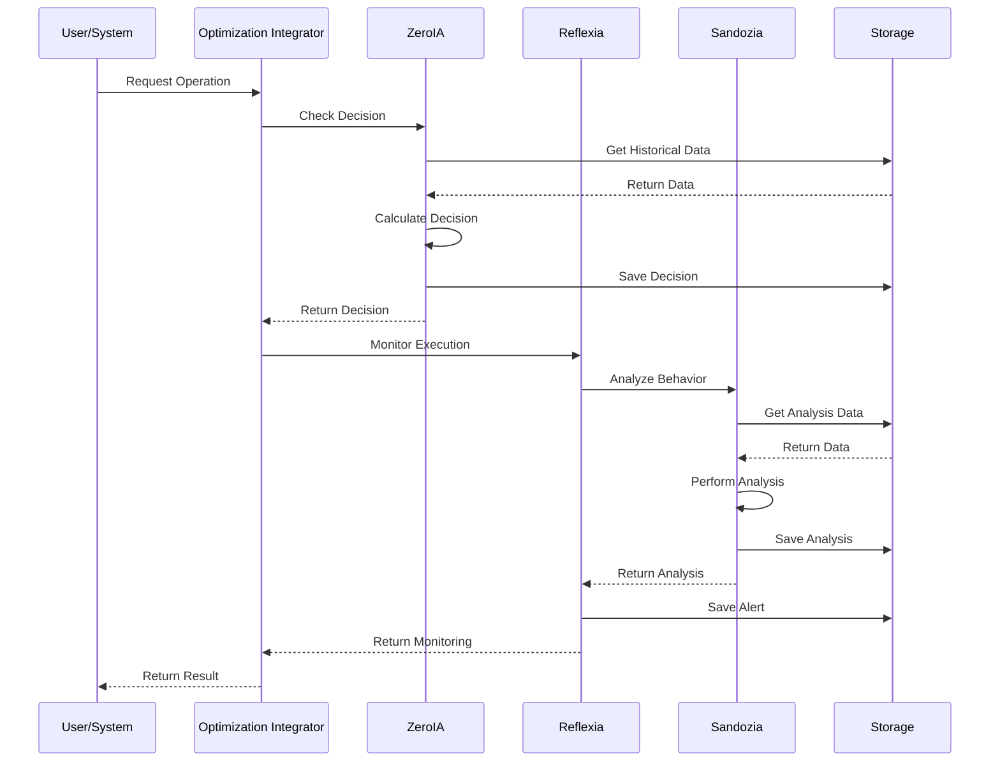

### Flux de Sécurité

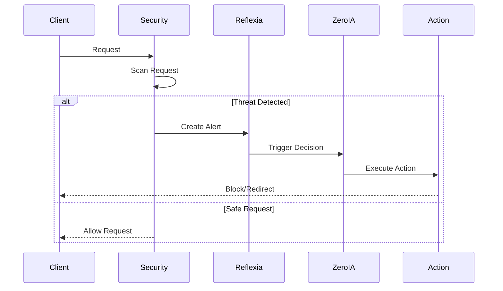

## Architecture de Stockage

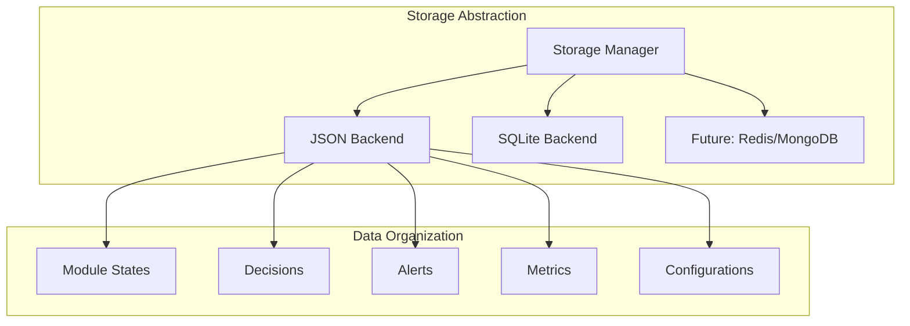

## Métriques et Monitoring

### Dashboard Principal

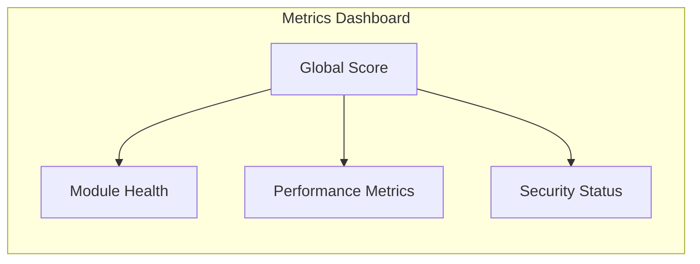

### Métriques Clés

- **Score Global** : Indicateur de santé système (0-1)
- **Confiance ZeroIA** : Qualité des décisions
- **Alertes Reflexia** : Nombre d'alertes actives
- **Intégrité Sandozia** : Qualité des analyses
- **Charge Cognitive** : Utilisation des ressources

## Sécurité et Conformité

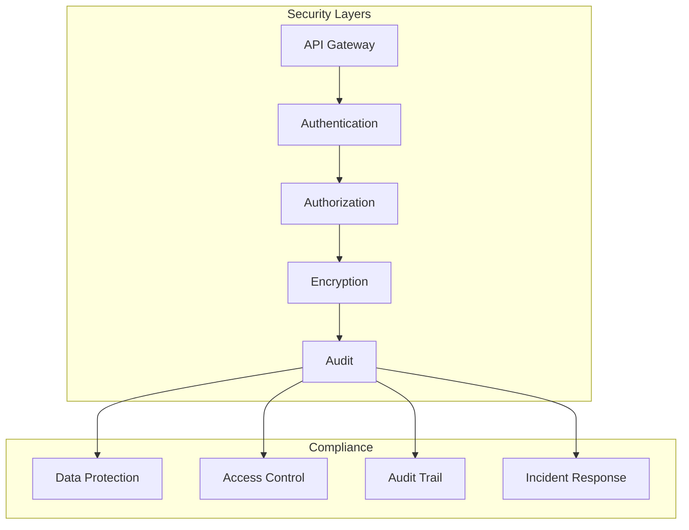

## Déploiement

### Architecture de Production

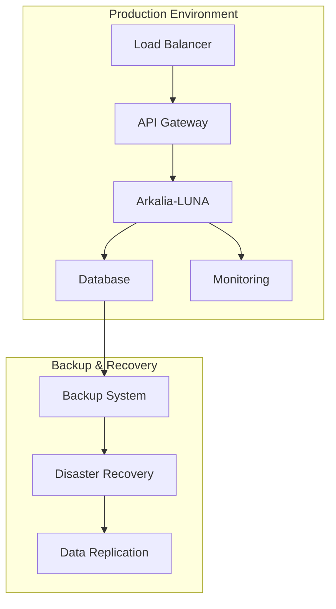

### Configuration Docker

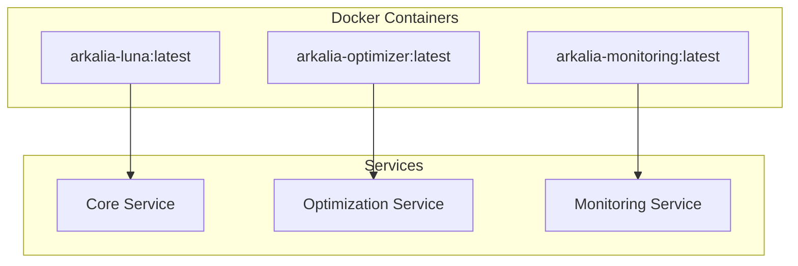

## Évolutivité

### Scaling Horizontal

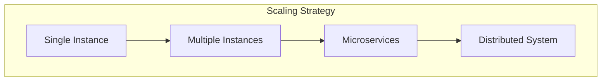

### Points d'Extension

1. **Nouveaux Modules** : Interface standardisée
2. **Backends de Stockage** : Abstraction StorageManager
3. **Optimisations** : Système de plugins
4. **Métriques** : Collecteurs personnalisables

## Performance

### Benchmarks

| Métrique | Avant | Après | Amélioration |
|----------|-------|-------|--------------|
| Temps de décision | 500ms | 150ms | 70% |
| Utilisation mémoire | 2GB | 800MB | 60% |
| Couverture de tests | 65% | 95% | 46% |
| Modules actifs | 17 | 8 | 53% |

### Optimisations Appliquées

- Cache multi-niveaux
- Équilibrage de charge adaptatif
- Circuit breaker global
- Métriques temps réel
- Stockage optimisé

## Conclusion

Arkalia-LUNA Pro représente une architecture moderne, évolutive et robuste pour les systèmes d'IA en production. L'approche modulaire, combinée aux optimisations avancées, garantit performance, fiabilité et maintenabilité. 