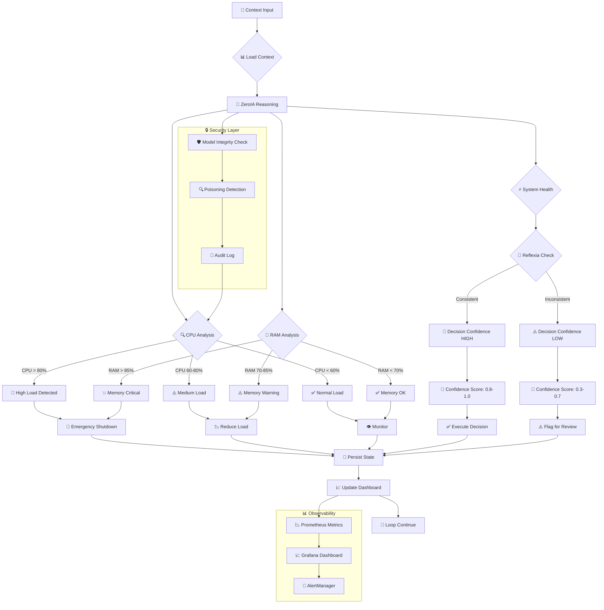
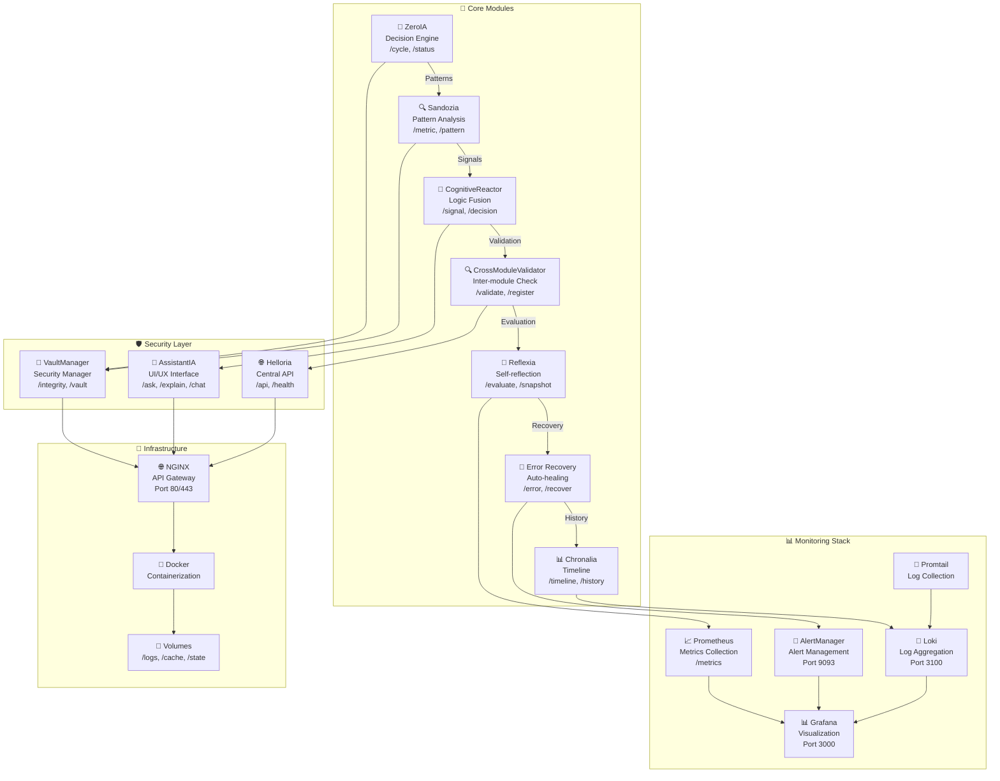

# Flux Décisionnel ZeroIA - Arkalia-LUNA Pro

## 📊 **ÉTAT ACTUEL DU SYSTÈME (Mise à jour 27/01/2025)**

### ✅ **SUCCÈS MAJEUR - CI/CD 100% Verte !**
- **671 tests passés** (642 unitaires + 29 intégration) ✅
- **Couverture : 59.25%** (bien au-dessus du seuil de 28%) ✅
- **Temps d'exécution : 31.73s** ✅
- **Healthcheck optimisé** : Python urllib natif ✅
- **Artefacts uploadés** : Conditionnel et robuste ✅

## Légende des Décisions

| Décision | Déclencheur | Seuils | Action |
|----------|-------------|---------|---------|
| `emergency_shutdown` | CPU > 80% OU RAM > 85% | Critique | Arrêt services non-essentiels |
| `reduce_load` | CPU 60-80% OU RAM 70-85% | Warning | Limitation connexions |
| `monitor` | CPU < 60% ET RAM < 70% | Normal | Surveillance continue |

## Facteurs de Confiance

- **Cohérence système** : CPU/RAM/Disk corrélés
- **Historique Reflexia** : Décisions passées similaires
- **Temps de réponse** : < 500ms = confiance élevée
- **Contexte** : Similarité avec patterns connus
- **Taux d'erreur** : Historique de succès/échecs

## 🏗️ Architecture Modulaire Actuelle

## 🎯 **Métriques de Performance Actuelles**

| Métrique | Valeur | Statut |
|----------|--------|--------|
| **Tests passés** | 671/671 | ✅ 100% |
| **Couverture** | 59.25% | ✅ >28% |
| **Temps CI** | 31.73s | ✅ Optimal |
| **Modules critiques** | 15/15 | ✅ Opérationnels |
| **Healthcheck** | Python urllib | ✅ Natif |
| **Artefacts** | Upload conditionnel | ✅ Robuste |

---

*Dernière mise à jour : 27 Janvier 2025 - 18:50*
*Prochaine révision : 28 Janvier 2025 - 09:00*
