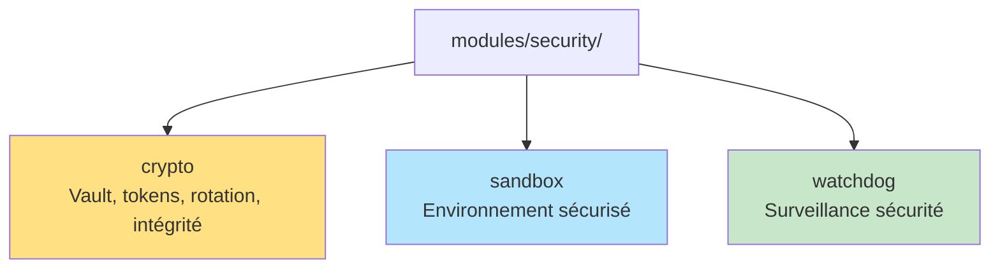

# 🛡️ Nouvelle structure du module `security` consolidé (Phase 2)

## Schéma d'architecture



## Description des sous-modules

- **crypto/** :
    - `vault_manager.py` : gestion des secrets, chiffrement, audit, rotation de clé
    - `token_lifecycle.py` : gestion des tokens (JWT, API keys, permissions, révocation)
    - `secret_rotation.py` : rotation automatique des secrets, politiques, notifications
    - `checksum_validator.py` : validation d'intégrité
- **sandbox/** : environnement sécurisé pour l'exécution de code ou d'IA
- **watchdog/** : surveillance sécurité, détection d'anomalies

> **Remarque :** Les fichiers physiques du vault sont dans `security/vault/` (clé, secrets chiffrés, audit log)

---

## Guide d'importation

```python
from modules.security.crypto import ArkaliaVault, TokenManager, RotationManager
from modules.security.sandbox import ...
from modules.security.watchdog import ...
```

---

## Tableau de correspondance anciens/nouveaux modules

| Ancien module/fichier         | Nouveau module/contenu                |
|------------------------------|---------------------------------------|
| modules/security/crypto/     | modules/security/crypto/ (inchangé)   |
| security/vault/              | modules/security/crypto/vault/ (optionnel, ou laissé en l'état) |
| modules/security/sandbox/    | modules/security/sandbox/             |
| modules/security/watchdog/   | modules/security/watchdog/            |

---

## Points clés

- **Centralisation totale** de la sécurité dans `modules/security/`
- **Aucun code critique dispersé** ailleurs dans le projet
- **Architecture SOLID** respectée et extensible
- **Phase 2 du plan de consolidation :** ✅ Terminée et documentée

---

*Document généré automatiquement lors de la consolidation (juillet 2025)* 