# 🤖 AssistantIA — Module Cognitif Intégré

Le module `assistantia/` est l’interface d’assistance IA locale d’Arkalia-LUNA. Il agit comme **guide conversationnel**, interface cognitive et **répondant intelligent** aux requêtes utilisateurs.

---

## 🧠 Rôle du module

- Dialogue IA avec l’utilisateur
- Réponses contextuelles personnalisées
- Interface évolutive vers l’IA autonome embarquée
- Support aux modules (Helloria, Reflexia…)

---

## 🚀 Lancement manuel

```bash
uvicorn modules.assistantia.core:app --port 8001

📍 Port configurable dans docker-compose.yml ou config/.

⸻

🔁 Endpoints disponibles

Méthode
URL
Description
POST
/chat
Envoie un message à l’IA locale
GET
/status
État du module assistantia

🧪 Tests associés

Fichiers :
	•	test_assistantia.py (unitaires)
	•	test_assistantia_integration.py (intégration)

✅ Couverture : 81 % — avec plan d’extension vers les cas d’erreur et logs détaillés.

⸻

🌐 Connectivité modulaire

Le module est connecté à :
	•	helloria/ (API externe)
	•	reflexia/ (logs et surveillance IA)
	•	nyxalia/ (interprétation mobile)

💡 Il est prêt pour une extension vers Ollama, Langchain, ou des modèles hybrides.

⸻

🎯 Objectif futur : une IA embarquée réflexive, contextuelle, auto-ajustable.

# 🧠 AssistantIA — Utilisation et Intégration LLM

L'AssistantIA est conçu pour offrir une interaction fluide et intelligente avec les utilisateurs, en intégrant des modèles de langage de pointe (LLM) pour comprendre et répondre aux requêtes de manière contextuelle.

## 🚀 Fonctionnalités Principales

- **Réponses Contextuelles** : Grâce à l'intégration de modèles LLM comme Mistral et Llama2, l'AssistantIA peut fournir des réponses précises et adaptées au contexte de la conversation.
- **Personnalisation** : L'AssistantIA s'adapte aux préférences de l'utilisateur, offrant une expérience personnalisée.
- **Intégration Facile** : Peut être intégré dans diverses applications via des API REST, facilitant l'interaction avec d'autres systèmes.

## 🌐 Exemple d'Utilisation

```bash
curl -X POST http://localhost:8000/chat \
  -H "Content-Type: application/json" \
  -d '{"message": "Quelle est la philosophie d'Arkalia ?"}'
```

## 🧠 Modèles LLM Intégrés

L'AssistantIA utilise des modèles LLM locaux pour garantir la confidentialité et l'efficacité. Les modèles sont stockés localement et peuvent être mis à jour ou remplacés selon les besoins.

## 📊 Structure JSON Entrante/Sortante

### Requête

```json
{
  "message": "Bonjour Arkalia",
  "mode": "empathique",
  "lang": "fr",
  "user_id": "12345"
}
```

### Réponse

```json
{
  "réponse": "Bonjour ! Je suis AssistantIA, prêt à vous aider."
}
```

## ⚙️ Paramètres Optionnels

- **mode** : Définit le mode de raisonnement de l'IA (ex: neutre, empathique).
- **lang** : Langue de réponse attendue (ex: fr, en).
- **user_id** : Identifiant utilisateur pour personnalisation.

## 📈 Schéma d'Interaction

```mermaid
sequenceDiagram
    participant U as Utilisateur
    participant A as AssistantIA
    participant O as Ollama
    U->>A: POST /chat (message)
    A->>O: Query modèle
    O-->>A: Réponse IA
    A-->>U: JSON { "réponse": "..." }
```



---

🧠 *L'AssistantIA est votre partenaire intelligent pour une interaction IA enrichissante et sécurisée.*

Pour des considérations de sécurité, veuillez consulter [Sécurité](security.md).