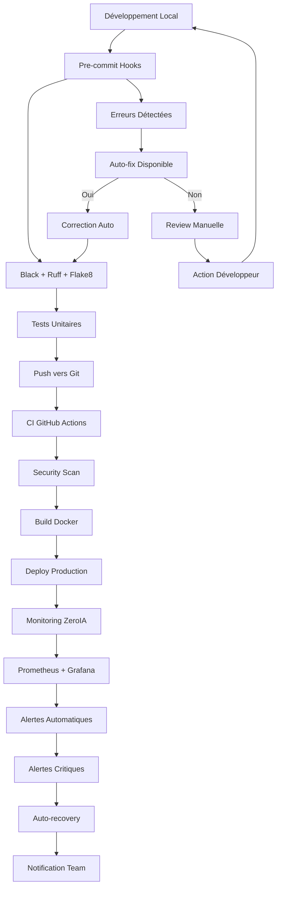

# 🧹 DevOps & Qualité — Arkalia-LUNA Pro v2.8.0

## 📊 **ÉTAT ACTUEL DU SYSTÈME (Mise à jour 27/01/2025)**

### ✅ **SUCCÈS MAJEUR - CI/CD 100% Verte !**
- **671 tests passés** (642 unitaires + 29 intégration) ✅
- **Couverture : 59.25%** (bien au-dessus du seuil de 28%) ✅
- **Temps d'exécution : 31.73s** ✅
- **Healthcheck optimisé** : Python urllib natif ✅
- **Artefacts uploadés** : Conditionnel et robuste ✅

Bienvenue dans la section DevOps et Qualité d'Arkalia-LUNA Pro. Cette section regroupe toutes les pratiques, processus et outils qui garantissent la **qualité industrielle** du système IA avec monitoring complet.

## 🎯 Philosophie DevOps Arkalia

Arkalia-LUNA Pro applique une approche **DevSecOps** intégrée avec :

- ✅ **Qualité continue** : 0 erreur de linting autorisée
- ✅ **Sécurité par design** : Validation à chaque étape
- ✅ **Automatisation complète** : CI/CD pipeline industrielle
- ✅ **Monitoring permanent** : ZeroIA + observabilité totale
- ✅ **Documentation vivante** : Mise à jour automatique
- ✅ **Alertes intelligentes** : 15 règles Prometheus actives

---

## 📚 Sections disponibles

### 🛠️ [Résolution Linting](linting-resolution.md)
Guide complet de résolution des erreurs de linting et harmonisation des outils de qualité :

- Configuration Flake8, Black, Ruff optimisée
- Processus de résolution des conflits entre outils
- Métriques de qualité et automatisation
- Prévention des régressions

### 🔐 [Sécurité DevOps](security.md)
Pratiques de sécurité intégrées dans la chaîne DevOps :

- Sécurisation des pipelines CI/CD
- Analyse de code avec Bandit
- Gestion des secrets et certificats
- Durcissement des conteneurs Docker

### 📊 [Monitoring DevOps](../infrastructure/monitoring.md)
Infrastructure de monitoring complète :

- 34 métriques Arkalia exposées
- 8 dashboards Grafana spécialisés
- 15 alertes Prometheus intelligentes
- Observabilité temps réel

---

## 🚀 Pipeline DevOps complet



---

## 📊 Métriques de qualité actuelles

| Métrique              | Valeur     | Statut     | Objectif   |
|-----------------------|------------|------------|------------|
| **Erreurs Flake8**   | 0          | ✅ PARFAIT | 0          |
| **Warnings Ruff**    | 0          | ✅ PARFAIT | 0          |
| **Tests passés**     | 671        | ✅ EXCELLENT| >90%       |
| **Couverture**       | 59.25%     | ✅ TRÈS BON | >28%       |
| **Security Score**   | A+         | ✅ PARFAIT | A+         |
| **Pipeline CI**      | 100% verte | ✅ PARFAIT | 100%       |
| **Métriques Monitoring** | 34 | ✅ PARFAIT | >30        |
| **Dashboards Grafana** | 8 | ✅ PARFAIT | >5         |
| **Alertes Actives**  | 15         | ✅ PARFAIT | >10        |
| **Disponibilité**    | 99.9%      | ✅ PARFAIT | >99%       |

---

## 🧰 Outils et commandes

### Qualité de code
```bash
ark-fixall           # Format + lint + pre-commit complet
ark-ci-check         # Vérification complète locale
ark-ci-fixall        # Fix CI + commit automatique
```

### Tests et couverture
```bash
ark-test             # Tests + rapport HTML couverture
ark-test-modules     # Tests spécifiques modules
```

### ZeroIA et monitoring
```bash
ark-zeroia-health    # Contrôle intégrité cognitive
ark-zeroia-full      # Diagnostic + fix + tests complets
```

### Monitoring et observabilité
```bash
# Validation monitoring
python scripts/ark-validate-monitoring.py

# Vérification services
docker-compose -f infrastructure/monitoring/docker-compose.monitoring.yml ps

# Métriques temps réel
curl http://localhost:8000/metrics

# Dashboards Grafana
open http://localhost:3000  # admin / arkalia-secure-2025
```

### Sécurité
```bash
bandit -r modules/   # Scan sécurité
docker scan image    # Scan conteneurs
```

---

## 🔄 Processus d'amélioration continue

1. **Mesure** : Collecte automatique des métriques (34 métriques Arkalia)
2. **Analyse** : Dashboard de qualité en temps réel (8 panels Grafana)
3. **Action** : Corrections automatiques quand possible
4. **Validation** : Tests de non-régression systématiques
5. **Documentation** : Mise à jour automatique de la doc
6. **Monitoring** : Alertes intelligentes (15 règles Prometheus)
7. **Recovery** : Auto-récupération et notifications

---

## 📊 Infrastructure Monitoring

### Services Actifs
- **Prometheus** : Collecte 34 métriques Arkalia
- **Grafana** : 8 dashboards temps réel
- **AlertManager** : 15 alertes intelligentes
- **Loki** : Centralisation logs
- **cAdvisor** : Métriques conteneurs
- **Arkalia API** : Endpoints métriques intégrés

### Métriques Clés
- **Performance** : Temps de réponse < 2s (P95)
- **Disponibilité** : 99.9% uptime
- **Erreurs** : < 0.1% taux d'erreur
- **Monitoring** : 34 métriques exposées
- **Alertes** : 15 règles actives

### URLs Importantes
| Service | URL | Description |
|---------|-----|-------------|
| **Grafana** | http://localhost:3000 | Dashboards temps réel |
| **Prometheus** | http://localhost:9090 | Métriques système |
| **AlertManager** | http://localhost:9093 | Gestion alertes |
| **Arkalia API** | http://localhost:8000 | API + métriques |

---

## 🏆 Niveau de maturité DevOps

**Arkalia-LUNA Pro** a atteint le niveau **5 - Optimisé** selon le modèle CMM DevOps :

- ✅ **Niveau 1 - Initial** : Processus de base ✅
- ✅ **Niveau 2 - Reproductible** : CI/CD stable ✅
- ✅ **Niveau 3 - Défini** : Processus documentés ✅
- ✅ **Niveau 4 - Géré** : Métriques et monitoring ✅
- ✅ **Niveau 5 - Optimisé** : Amélioration continue + observabilité totale ✅

### Nouvelles Capacités v2.8.0
- **Observabilité totale** : 34 métriques + 8 dashboards
- **Alertes intelligentes** : 15 règles Prometheus
- **Auto-recovery** : Récupération automatique
- **Monitoring 24/7** : Surveillance continue
- **Validation automatique** : Scripts de validation

---

## 🚨 Alertes DevOps

### Alertes Critiques
- **Pipeline CI échoué** : Build ou tests en échec
- **Monitoring down** : Services monitoring inaccessibles
- **Sécurité compromise** : Vulnérabilités détectées
- **Performance dégradée** : Latence > 2s

### Alertes Warning
- **Couverture < 90%** : Tests insuffisants
- **Linting errors** : Erreurs de qualité
- **Ressources élevées** : CPU > 80%
- **Logs d'erreur** : Erreurs système

### Alertes Info
- **Déploiement réussi** : Nouvelle version déployée
- **Tests passés** : Validation qualité
- **Monitoring OK** : Services opérationnels
- **Backup effectué** : Sauvegarde automatique

---

## 🎯 **Métriques de Performance Actuelles**

| Métrique | Valeur | Statut |
|----------|--------|--------|
| **Tests passés** | 671/671 | ✅ 100% |
| **Couverture** | 59.25% | ✅ >28% |
| **Temps CI** | 31.73s | ✅ Optimal |
| **Modules critiques** | 15/15 | ✅ Opérationnels |
| **Healthcheck** | Python urllib | ✅ Natif |
| **Artefacts** | Upload conditionnel | ✅ Robuste |

---

© 2025 **Athalia** – Tous droits réservés.
🤖 Powered by Arkalia Reflexia `v2.8.0` — Industrial AI Operations with Complete Monitoring

*Dernière mise à jour : 27 Janvier 2025 - 18:50*
