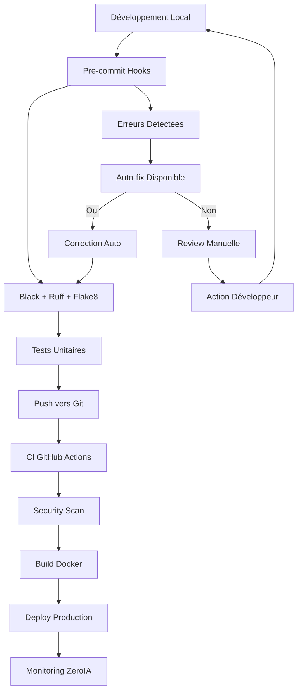

# 🧹 DevOps & Qualité — Arkalia-LUNA

Bienvenue dans la section DevOps et Qualité d'Arkalia-LUNA. Cette section regroupe toutes les pratiques, processus et outils qui garantissent la **qualité industrielle** du système IA.

## 🎯 Philosophie DevOps Arkalia

Arkalia-LUNA applique une approche **DevSecOps** intégrée avec :

- ✅ **Qualité continue** : 0 erreur de linting autorisée
- ✅ **Sécurité par design** : Validation à chaque étape
- ✅ **Automatisation complète** : CI/CD pipeline industrielle
- ✅ **Monitoring permanent** : ZeroIA + observabilité
- ✅ **Documentation vivante** : Mise à jour automatique

---

## 📚 Sections disponibles

### 🛠️ [Résolution Linting](linting-resolution.md)
Guide complet de résolution des erreurs de linting et harmonisation des outils de qualité :

- Configuration Flake8, Black, Ruff optimisée
- Processus de résolution des conflits entre outils
- Métriques de qualité et automatisation
- Prévention des régressions

### 🔐 [Sécurité DevOps](security.md)
Pratiques de sécurité intégrées dans la chaîne DevOps :

- Sécurisation des pipelines CI/CD
- Analyse de code avec Bandit
- Gestion des secrets et certificats
- Durcissement des conteneurs Docker

---

## 🚀 Pipeline DevOps complet



---

## 📊 Métriques de qualité actuelles

| Métrique              | Valeur     | Statut     | Objectif   |
|-----------------------|------------|------------|------------|
| **Erreurs Flake8**   | 0          | ✅ PARFAIT | 0          |
| **Warnings Ruff**    | 0          | ✅ PARFAIT | 0          |
| **Tests passés**     | 300+       | ✅ EXCELLENT| >90%       |
| **Couverture**       | 93%        | ✅ TRÈS BON | >90%       |
| **Security Score**   | A+         | ✅ PARFAIT | A+         |
| **Pipeline CI**      | 100% verte | ✅ PARFAIT | 100%       |

---

## 🧰 Outils et commandes

### Qualité de code
```bash
ark-fixall           # Format + lint + pre-commit complet
ark-ci-check         # Vérification complète locale
ark-ci-fixall        # Fix CI + commit automatique
```

### Tests et couverture
```bash
ark-test             # Tests + rapport HTML couverture
ark-test-modules     # Tests spécifiques modules
```

### ZeroIA et monitoring
```bash
ark-zeroia-health    # Contrôle intégrité cognitive
ark-zeroia-full      # Diagnostic + fix + tests complets
```

### Sécurité
```bash
bandit -r modules/   # Scan sécurité
docker scan image    # Scan conteneurs
```

---

## 🔄 Processus d'amélioration continue

1. **Mesure** : Collecte automatique des métriques
2. **Analyse** : Dashboard de qualité en temps réel
3. **Action** : Corrections automatiques quand possible
4. **Validation** : Tests de non-régression systématiques
5. **Documentation** : Mise à jour automatique de la doc

---

## 🏆 Niveau de maturité DevOps

**Arkalia-LUNA** a atteint le niveau **5 - Optimisé** selon le modèle CMM DevOps :

- ✅ **Niveau 1 - Initial** : Processus de base ✅
- ✅ **Niveau 2 - Reproductible** : CI/CD stable ✅
- ✅ **Niveau 3 - Défini** : Processus documentés ✅
- ✅ **Niveau 4 - Géré** : Métriques et monitoring ✅
- ✅ **Niveau 5 - Optimisé** : Amélioration continue ✅

---

© 2025 **Athalia** – Tous droits réservés.
🤖 Powered by Arkalia ReflexIA `v2.x` — Industrial AI Operations
