## 🧩 Module `helloria`

Module IA d’entrée logique. Sert de **point central de démarrage, ping et état**, ainsi que de **support pour extensions modulaires**.

| Méthode | Route    | Description                      |
|---------|----------|----------------------------------|
| GET     | /        | Ping racine                      |
| GET     | /status  | État général (via state)         |

```mermaid
flowchart LR
  Client -->|Ping| H1[/"GET /\"/]
  Client -->|État| H2[/"GET /status\"/]
  H1 & H2 --> Core[helloria.core]
  Core --> State[helloria.state]
``` 

