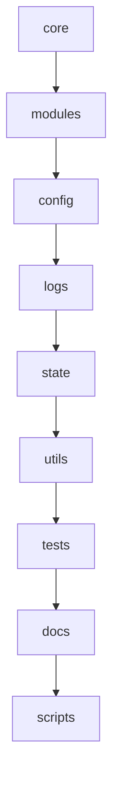

# 🧬 Structure du Noyau — Arkalia-LUNA

> Arkalia-LUNA repose sur une architecture **modulaire, lisible, performante** et 100 % locale. Chaque composant est isolé, orchestrable et testable de manière indépendante.

---

## 📂 Structure Principale

```plaintext
arkalia-luna-pro/
├── core/        # Logique partagée multi-modules
├── modules/     # Modules IA indépendants (Reflexia, Nyxalia, etc.)
├── config/      # Fichiers .toml, .json (centrés)
├── logs/        # Journaux d'activité (journalisation réflexive)
├── state/       # États internes persistants (sauvegardes IA)
├── utils/       # Fonctions techniques et connecteurs externes
├── tests/       # Tests unitaires et d'intégration (pytest)
├── docs/        # Documentation publique (MkDocs, Mermaid, etc.)
└── scripts/     # Scripts automatisés (build, test, docker, backup)
```

## 🧠 Diagramme de la Structure



---

🧠 *La force d'Arkalia réside dans sa clarté structurelle, sa cohérence cognitive et son évolutivité modulaire.*
