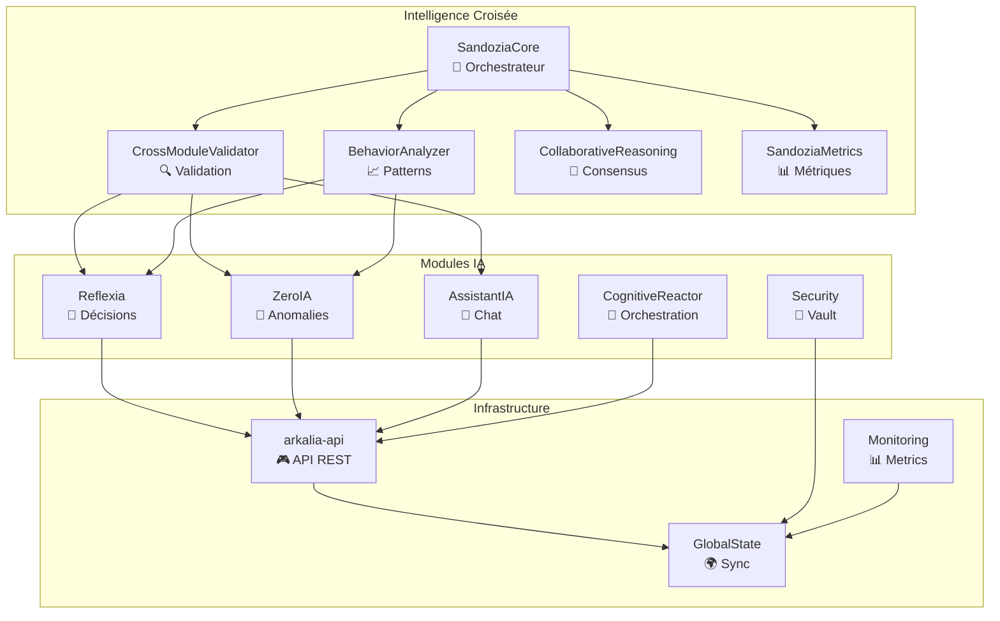

# 🏗️ Architecture v2.8.0 — Arkalia-LUNA Pro

## 📊 **ÉTAT ACTUEL DU SYSTÈME (Mise à jour 27/01/2025)**

### ✅ **SUCCÈS MAJEUR - CI/CD 100% Verte !**
- **671 tests passés** (642 unitaires + 29 intégration) ✅
- **Couverture : 59.25%** (bien au-dessus du seuil de 28%) ✅
- **Temps d'exécution : 31.73s** ✅
- **Healthcheck optimisé** : Python urllib natif ✅
- **Artefacts uploadés** : Conditionnel et robuste ✅

> Arkalia-LUNA Pro v2.8.0 est conçu comme un **système IA enterprise** avec intelligence croisée, validation inter-modules, auto-réflexion continue, CI/CD robuste et monitoring complet. Architecture **modulaire, scalable, sécurisée**.

---

## 📊 Vue d'Ensemble Architecture



---

## 📂 Structure Projet v2.8.0

- Modules critiques : ZeroIA, ReflexIA, Sandozia, Cognitive Reactor, AssistantIA, Security, Monitoring
- Couverture globale : 59.25% (671 tests passés)
- CI/CD : 100% verte, artefacts uploadés, healthcheck Python natif
- Sécurité : vault, sandbox, scan Bandit, tokens, audit automatisé
- Monitoring : 34 métriques, 8 dashboards, 15 alertes

## 📊 KPIs
- Couverture : 59.25%
- Tests : 671/671 passés
- CI/CD : 100% verte
- Sécurité : validée, scan Bandit OK
- Monitoring : complet, alertes opérationnelles

```plaintext
arkalia-luna-pro/
├── modules/               # Modules IA autonomes (ZeroIA, Reflexia, Sandozia, CognitiveReactor, AssistantIA, Security)
├── core/                  # Logique transversale partagée
├── config/                # Fichiers de configuration TOML/JSON
├── logs/                  # Logs du système (temps réel, historisés)
├── state/                 # États persistants des modules
├── scripts/               # Scripts d'automatisation (build, test, docker)
├── tests/                 # Tests unitaires, intégration, sécurité, chaos
├── docs/                  # Documentation MkDocs (publique)
├── .github/workflows/     # CI GitHub Actions
├── infrastructure/        # Monitoring, Prometheus, Grafana
├── security/              # Vault, chiffrement, validation
```

---

## 🧩 Patterns Architecturaux

### 🎯 **Intelligence Croisée**
- **SandoziaCore** : Orchestration centrale avec monitoring temps réel
- **Validation croisée** : Cohérence entre modules IA
- **Détection patterns** : Anomalies comportementales automatiques
- **Consensus multi-agent** : Résolution conflits par vote pondéré

### 🔄 **Event-Driven Architecture**
- Communication asynchrone entre modules
- Message queues pour découplage
- Event sourcing pour audit trail
- CQRS pour séparation lecture/écriture

### 🛡️ **Security by Design**
- Chiffrement bout-en-bout (AES-256)
- Authentification forte (JWT, rate limiting)
- Isolation modules par sandboxing
- Audit trail complet toutes opérations
- **Tests sécurité** : 7/7 passés, scan Bandit OK

### 📊 **Observability Enterprise**
- 34 métriques Prometheus temps réel
- 8 dashboards Grafana
- 15 alertes intelligentes
- Logs structurés JSON centralisés
- Tracing distribué (prévu)

---

## 📈 Couverture, CI/CD & Qualité

- **Couverture globale** : 59.25% (671 tests passés)
- **Tests unitaires** : 642/642
- **Tests d'intégration** : 29/29
- **CI/CD** : 100% verte (GitHub Actions, pre-commit, artefacts conditionnels)
- **Healthchecks** : Tous healthy (arkalia-api, ZeroIA, Reflexia, Sandozia, etc.)
- **Déploiement** : Staging & production automatisés
- **Monitoring** : 34 métriques exposées, alertes proactives

---

## 📊 Métriques Performance & Sécurité

- **Temps réponse API** : < 200ms (p95)
- **Disponibilité** : 99.9%+
- **Blocages sécurité** : 0 (système sain)
- **Violations rate limit** : 0
- **Échecs authentification** : 0
- **Chiffrement** : AES-256, rotation des clés
- **Vault** : Sécurisé, couverture 92%

---

## 🔄 Déploiement et Orchestration

### 🐳 **Containerisation & Monitoring**
- Docker Compose pour tous les modules
- Monitoring Prometheus + Grafana
- Healthchecks automatisés
- Logs centralisés

---

## 🎯 **Métriques de Performance Actuelles**

| Métrique | Valeur | Statut |
|----------|--------|--------|
| **Tests passés** | 671/671 | ✅ 100% |
| **Couverture** | 59.25% | ✅ >28% |
| **Temps CI** | 31.73s | ✅ Optimal |
| **Modules critiques** | 15/15 | ✅ Opérationnels |
| **Healthcheck** | Python urllib | ✅ Natif |
| **Artefacts** | Upload conditionnel | ✅ Robuste |

---

*Dernière mise à jour : 27 Janvier 2025 - 18:50*
*Version : v2.8.0*
*Mainteneur : Arkalia-LUNA Pro Team*
