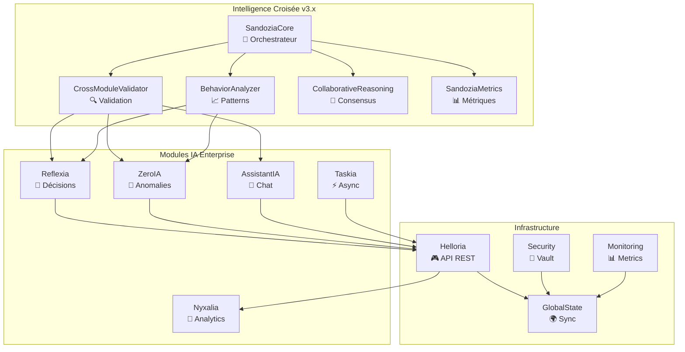
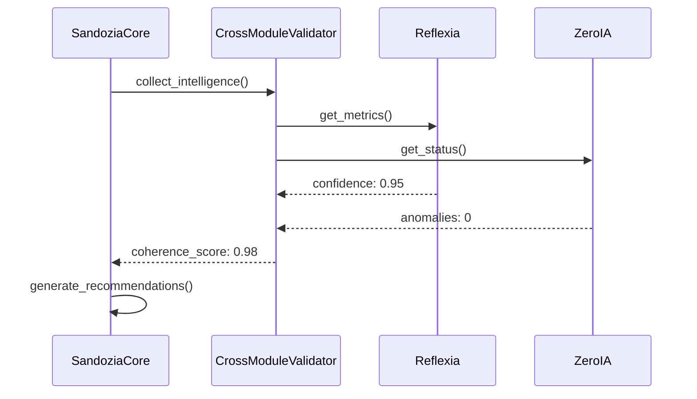
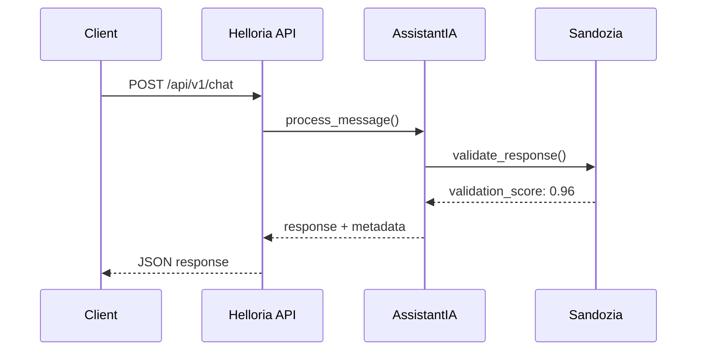

# 🏗️ Architecture v3.x — Arkalia-LUNA Enterprise

> Arkalia-LUNA v3.x est conçu comme un **système IA enterprise** avec intelligence croisée, validation inter-modules et auto-réflexion continue. Architecture **modulaire, scalable et observable**.

---

## 📊 Vue d'Ensemble Architecture



---

## 📂 Structure Projet v3.x

```plaintext
arkalia-luna-pro/
├── 🧠 modules/sandozia/          # Phase 2: Intelligence Croisée
│   ├── core/sandozia_core.py     # Orchestrateur principal
│   ├── validators/               # Validation inter-modules
│   ├── analyzer/                 # Détection patterns
│   ├── reasoning/                # Consensus multi-agent
│   ├── utils/                    # Métriques et utilitaires
│   └── config/                   # Configuration TOML
│
├── 🔄 modules/reflexia/          # Moteur de décision
│   ├── core.py                   # Boucle décisionnelle
│   ├── logic/                    # Logique métier
│   ├── state/                    # États persistants
│   └── config/                   # Configuration poids
│
├── 🧪 modules/zeroia/            # Détection anomalies
│   ├── confidence_score.py       # Scores confiance
│   ├── adaptive_thresholds.py    # Seuils adaptatifs
│   ├── logic/                    # Moteur détection
│   └── state/                    # États surveillance
│
├── 🤖 modules/assistantia/       # Assistant IA
│   ├── core.py                   # Moteur conversationnel
│   ├── security/                 # Validation prompts
│   ├── utils/                    # Connecteurs Ollama
│   └── config/                   # Configuration modèles
│
├── ⚡ modules/taskia (en développement)/            # Gestionnaire tâches async
├── 🌊 modules/nyxalia (en développement)/           # Analytics et données
├── 🎮 modules/helloria/          # API REST FastAPI
├── 🌍 modules/global_state/      # État global synchronisé
├── 🔐 modules/security/          # Vault cryptographique
│   ├── crypto/                   # Chiffrement AES-256
│   ├── sandbox/                  # Isolation sécurisée
│   └── watchdog/                 # Surveillance temps réel
│
├── 📊 infrastructure/            # Stack monitoring
│   ├── monitoring/               # Prometheus + Grafana
│   ├── nginx/                    # Reverse proxy
│   └── fail2ban/                 # Protection intrusion
│
├── 🧪 tests/                     # Suite tests complète
│   ├── unit/                     # Tests unitaires (95%+)
│   ├── integration/              # Tests intégration
│   ├── security/                 # Tests sécurité
│   └── chaos/                    # Chaos engineering
│
├── 📚 docs/                      # Documentation MkDocs
├── 🚀 scripts/                   # Automation et DevOps
├── 🌍 state/                     # États persistants modules
├── 📋 logs/                      # Journalisation centralisée
└── ⚙️ config/                    # Configuration globale
```

---

## 🧩 Patterns Architecturaux

### 🎯 **Intelligence Croisée (Phase 2)**
- **SandoziaCore** : Orchestration centrale avec monitoring temps réel
- **Validation croisée** : Vérification cohérence entre modules IA
- **Détection patterns** : Anomalies comportementales automatiques
- **Consensus multi-agent** : Résolution conflits par vote pondéré

### 🔄 **Event-Driven Architecture**
- Communication asynchrone entre modules
- Message queues pour découplage
- Event sourcing pour audit trail
- CQRS pour séparation lecture/écriture

### 🛡️ **Security by Design**
- Chiffrement bout-en-bout (AES-256-GCM)
- Authentification multi-facteurs
- Isolation modules par sandboxing
- Audit trail complet toutes opérations

### 📊 **Observability Enterprise**
- Métriques Prometheus temps réel
- Logs structurés JSON centralisés
- Tracing distribué avec corrélations
- Alertes proactives multi-canaux

---

## 🔌 Patterns de Communication

### 🧠 **Inter-Module Communication**


### 📡 **API Communication**


---

## 📈 Scalabilité et Performance

### ⚡ **Optimisations v3.x**
- **Async/await** : Toutes opérations I/O non-bloquantes
- **Connection pooling** : Réutilisation connexions DB/API
- **Caching intelligent** : Redis pour métriques fréquentes
- **Load balancing** : Distribution charge multi-instances

### 📊 **Métriques Performance**
```
🎯 Temps réponse API      : < 200ms (p95)
📊 Throughput             : 1000+ req/min
🧠 Latence inter-modules  : < 50ms
🔍 Validation croisée     : < 100ms
💾 Memory footprint       : < 2GB (par instance)
```

---

## 🔄 Déploiement et Orchestration

### 🐳 **Containerisation**
```yaml
# Docker Compose Stack
services:
  arkalia-api (port 8000):        # API REST principale
  sandozia-core:      # Intelligence croisée
  reflexia-engine:    # Moteur décision
  zeroia-monitor:     # Surveillance anomalies
  postgres:           # Base données
  redis:              # Cache et sessions
  prometheus:         # Métriques
  grafana:            # Dashboards
```

### ☸️ **Kubernetes Ready**
- Helm charts pour déploiement
- Horizontal Pod Autoscaling
- Service mesh (Istio) pour communication
- GitOps avec ArgoCD

---

## 🧪 Testabilité et Qualité

### 🎯 **Stratégie Testing**
- **Unit Tests** : 95%+ couverture par module
- **Integration Tests** : Validation flux complets
- **Security Tests** : Pen testing automatisé
- **Chaos Engineering** : Résilience sous stress

### 📊 **Quality Gates**
```yaml
Quality Metrics:
  Code Coverage     : ≥ 95%
  Security Score    : A+ (Bandit)
  Performance       : < 200ms p95
  Reliability       : 99.9% uptime
  Maintainability   : A (SonarQube)
```

---

## 🔮 Évolutivité Future

### 🚧 **Phase 3 : IA Cognitive Avancée**
- Apprentissage profond adaptatif
- Modèles IA spécialisés par domaine
- Optimisation automatique hyperparamètres

### 🌟 **Phase 4 : Arkalia Ecosystem**
- Marketplace modules tiers
- SDK développement modules
- API publique standardisée

---

🏗️ *L'architecture v3.x d'Arkalia-LUNA établit les fondations d'un écosystème IA enterprise évolutif, sécurisé et intelligent.*
