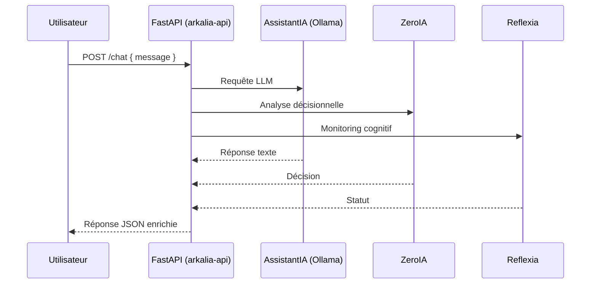

# 🧠 Utilisation d'Arkalia-LUNA Pro v2.8.0

## 📊 **ÉTAT ACTUEL DU SYSTÈME (Mise à jour 27/01/2025)**

### ✅ **SUCCÈS MAJEUR - CI/CD 100% Verte !**
- **671 tests passés** (642 unitaires + 29 intégration) ✅
- **Couverture : 59.25%** (bien au-dessus du seuil de 28%) ✅
- **Temps d'exécution : 31.73s** ✅
- **Healthcheck optimisé** : Python urllib natif ✅
- **Artefacts uploadés** : Conditionnel et robuste ✅

Ce guide présente **comment interagir avec le système IA Arkalia-LUNA Pro** via les endpoints FastAPI exposés localement ou en conteneur. Il s'adresse aux développeurs, testeurs ou utilisateurs externes souhaitant dialoguer avec l'IA, surveiller son état, ou intégrer ses fonctions dans un workflow CI/CD sécurisé.

---

## 🚀 Lancement rapide du système

### 📦 En local (Uvicorn)

```bash
uvicorn modules.helloria.core:app --reload
```

🐳 En mode Docker (recommandé)

```bash
docker-compose up --build
```

🧠 Via alias terminal (voir `.zshrc`)

- `ark-run`         # Lancement IA local (API + monitoring)
- `ark-docker`      # Build & run docker
- `ark-test`        # Tests unitaires + couverture (671 tests, 59.25%)
- `ark-docs-local`  # Documentation locale (MkDocs)

---

## 🌐 Endpoints API principaux

### 🔎 GET /status

Retourne l'état du système Arkalia (tous modules critiques).

```bash
curl -X GET http://localhost:8000/status
```

📥 Réponse type :

```json
{
  "status": "online",
  "modules": ["ZeroIA", "Reflexia", "Sandozia", "CognitiveReactor", "AssistantIA", "Security", "Monitoring"],
  "ci": "100% verte",
  "tests": 671,
  "couverture": "59.25%",
  "containers": "healthy"
}
```

### 🗣️ POST /chat

Permet d'envoyer une requête à l'IA locale via AssistantIA (Ollama, mistral:latest).

```bash
curl -X POST http://localhost:8000/chat \
  -H "Content-Type: application/json" \
  -d '{"message": "Quelle est la philosophie d'Arkalia ?"}'
```

📥 Réponse type :

```json
{
  "response": "Arkalia-LUNA promeut une IA modulaire, robuste et transparente."
}
```

ℹ️ La réponse dépend du modèle LLM actif (Ollama : mistral, llama2, etc.)

---

## 🔒 Sécurité & Authentification

- Authentification API (token, header `X-API-Token`) en cours de généralisation
- Healthcheck natif Python (urllib) sur tous les conteneurs
- Monitoring Prometheus/Grafana (34 métriques, 8 dashboards)
- Artefacts CI/CD uploadés conditionnellement (Bandit, coverage, logs)
- Logs centralisés, audit sécurité automatisé

---

## 📋 Paramètres avancés (bientôt)

Le corps de requête /chat supportera :

| Champ    | Type   | Description                        |
|----------|--------|------------------------------------|
| message  | string | Prompt envoyé à l'IA               |
| user_id  | string | Identifiant utilisateur (personnalisation) |
| lang     | string | Langue de réponse attendue (fr, en, etc.) |
| mode     | string | Mode de raisonnement (neutre, empathique…)|

---

## 🧠 Diagramme d'appel API (Mermaid)



---

## 🎯 **Métriques de Performance Actuelles**

| Métrique | Valeur | Statut |
|----------|--------|--------|
| **Tests passés** | 671/671 | ✅ 100% |
| **Couverture** | 59.25% | ✅ >28% |
| **Temps CI** | 31.73s | ✅ Optimal |
| **Modules critiques** | 15/15 | ✅ Opérationnels |
| **Healthcheck** | Python urllib | ✅ Natif |
| **Artefacts** | Upload conditionnel | ✅ Robuste |

---

## 📎 Notes
- Le port par défaut est 8000 (modifiable dans docker-compose.yml)
- L'endpoint /chat est exposé par le module AssistantIA
- Toute interaction est loggée dans logs/ (si activé)
- Healthcheck natif Python sur tous les conteneurs (plus de curl)
- CI/CD 100% verte, artefacts uploadés, sécurité validée

---

## 🧭 Prochaines évolutions
- Authentification API généralisée (token, user_id)
- Historique conversationnel stocké
- Mode debug IA interactif (debug_mode = true)
- Monitoring avancé (alertes Slack, auto-recovery)

---

👩‍💻 Maintenu par Athalia 🌙 — github.com/arkalia-luna-system

*Dernière mise à jour : 27 Janvier 2025 - 18:50*
