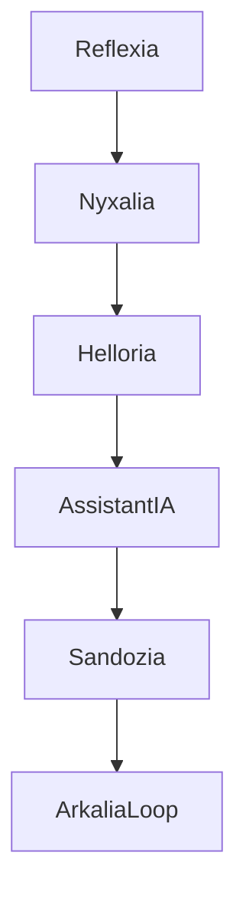
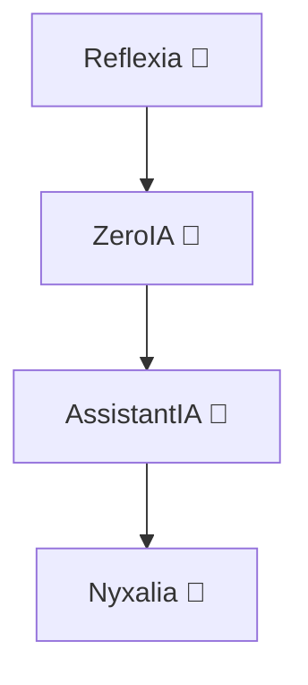
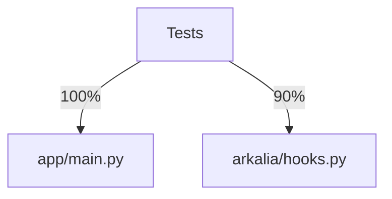
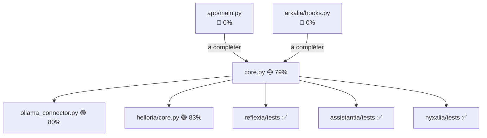
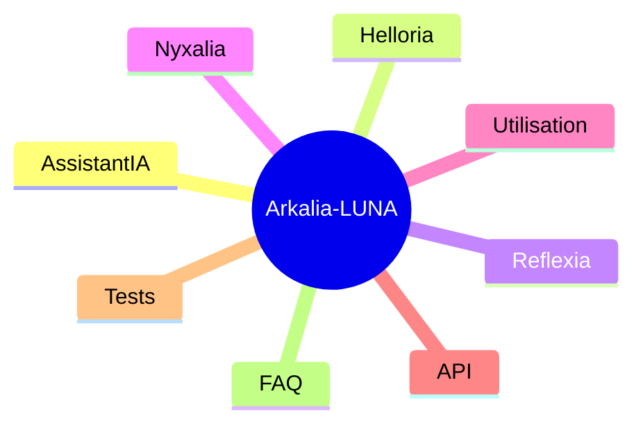

# 🧠 Arkalia-LUNA — Interface Cognitive Modulaire

Bienvenue dans **Arkalia-LUNA**, un système cognitif **modulaire, local, dockerisé, testé et documenté**.

Ce projet est conçu comme une **infrastructure IA stable** pour exécuter des modules intelligents, avec un **noyau ultra-protecteur** et une **documentation contextuelle**.

> "Arkalia-LUNA incarne l'avenir de l'IA locale : éthique, souveraine, et résolument tournée vers l'innovation."

---

## 📦 État du système

| Composant      | Statut      |
|----------------|-------------|
| 🧠 Kernel IA    | ✅ Stable   |
| 🧪 Tests CI/CD  | ✅ 100 % OK |
| 📦 Docker       | ✅ Fonctionnel |
| 📚 Docs MkDocs | ✅ Publiées |
| 🧩 Modules actifs | 4 modules IA |
| 🧪 Couverture | 93 % à 100 % par module |

---

## 📚 Pages importantes

- [🧠 Modules IA actifs](modules.md)
- [⚙️ Structure du projet](fonctionnement/structure.md)
- [🚀 Déploiement Docker](infrastructure/deployment.md)
- [🔄 Automatisation](modules/helloria.md)
- [📬 API & Intégration](modules/helloria.md)
- [🔒 Sécurité & CI/CD](infrastructure/ci-cd.md)

---

## 🧠 Vision du projet

> Arkalia-LUNA est pensé comme un **noyau d'interface cognitive locale**, auto-adaptative, sécurisée et évolutive. Chaque module fonctionne de manière autonome, dans un système orchestré, observable et auto-réparant.

---

## 📌 Dernière mise à jour : `v2.4.0` — 2025-06-19

## 📊 État des Modules

## 🧩 Interactions des Modules

## 📊 Couverture des Tests

## 📊 Couverture des Modules (Tests Unitaires)

## 🧠 Résumé Global des Modules IA

Arkalia-LUNA intègre plusieurs modules IA actifs, chacun jouant un rôle crucial dans le système :

- **AssistantIA** : Fournit des réponses contextuelles via l'API /chat.
- **Helloria** : Gère les requêtes entrantes via FastAPI.
- **Reflexia** : Supervise les performances et les métriques.
- **Nyxalia** : Assure la connectivité mobile et l'interface utilisateur.

## 📚 Liens Rapides

- [API Guide](api.md)
- [Ollama Guide](infrastructure/ollama.md)
- [Guide d'Utilisation](fonctionnement/utilisation.md)
- [Tests et CI/CD](infrastructure/ci-cd.md)
- [FAQ](faqs.md)

## 🧠 Mini Carte Mentale

---

© 2025 **Athalia** – Tous droits réservés.
🤖 Powered by Arkalia ReflexIA `v1.x`
