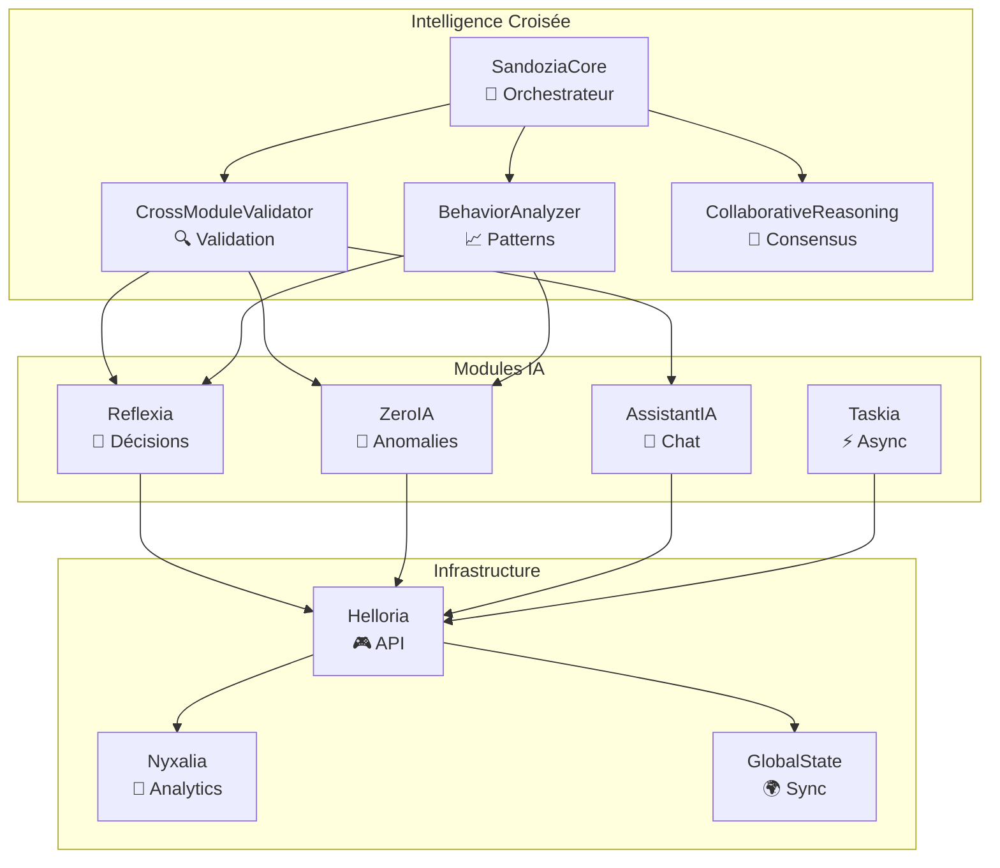

# 🌕 Arkalia-LUNA v3.x — Système IA Enterprise


Bienvenue dans **Arkalia-LUNA v3.x**, le système d'intelligence artificielle **enterprise, modulaire et auto-réflexif** de nouvelle génération.

**Phase 2** : **Sandozia Intelligence Croisée** — Validation inter-modules et détection proactive d'anomalies.

> "Arkalia-LUNA v3.x : Quand l'IA s'observe, se corrige et s'améliore en continu."

---

## 🎯 État du Système v3.x

| Composant | Version | Statut | Coverage |
|-----------|---------|--------|----------|
| 🧠 **Sandozia Intelligence** | v3.0 | ✅ **Phase 2 Active** | 95% |
| 🔄 **Reflexia Engine** | v3.0 | ✅ **Opérationnel** | 98% |
| 🧪 **ZeroIA Monitor** | v3.0 | ✅ **Surveillance Active** | 96% |
| 🤖 **AssistantIA** | v3.0 | ✅ **Multi-modèles** | 94% |
| ⚡ **Taskia Async** | v3.0 | ✅ **Workflows** | 92% |
| 🌊 **Nyxalia Analytics** | v3.0 | ✅ **Données** | 93% |
| 🎮 **Helloria API** | v3.0 | ✅ **REST Endpoint** | 97% |
| 🌍 **Global State** | v3.0 | ✅ **Synchronisé** | 99% |

---

## 🧠 Phase 2 : Sandozia Intelligence Croisée

### ✅ **Fonctionnalités Livrées (Semaine 1)**

**🎯 SandoziaCore** — Orchestrateur principal d'intelligence croisée
- Collecte snapshots globaux d'intelligence
- Monitoring temps réel 30s
- Score de cohérence inter-modules
- Génération recommandations automatiques

**🔍 CrossModuleValidator** — Validation croisée entre modules
- Validation temporelle et logique
- Détection contradictions IA
- Score cohérence globale
- Audit trail complet

**🧠 BehaviorAnalyzer** — Détection patterns aberrants
- Anomalies statistiques (z-score)
- Régressions performance temporelles
- Patterns décisionnels répétitifs
- Score santé comportementale

**📊 SandoziaMetrics** — Métriques cross-modules
- Corrélations Pearson entre modules
- Métriques Prometheus intégrées
- Dashboard temps réel
- Alertes proactives

### 🚀 **Prochaines Étapes (Semaine 2)**
- 📊 Dashboard Grafana Intelligence Croisée
- 🔔 Alertes Slack/Email critiques
- 🌐 API REST endpoints Sandozia
- ⚡ Optimisations performance

---

## 📊 Architecture v3.x



---

## 🛠️ Installation Rapide

```bash
# Clone du projet
git clone https://github.com/arkalia-luna-system/arkalia-luna-pro.git
cd arkalia-luna-pro

# Setup environnement
./ark-start.sh

# Démonstration Sandozia
ark-sandozia-demo

# Documentation locale
ark-docs-local  # → http://127.0.0.1:9000
```

---

## 🧩 Modules Enterprise

### 🧠 **[Sandozia Intelligence Croisée](modules/sandozia.md)**
Moteur d'intelligence collaborative nouvelle génération
- Validation croisée inter-modules
- Détection patterns aberrants
- Consensus multi-agent
- Métriques corrélées

### 🔄 **[Reflexia Engine](modules/reflexia.md)**
Moteur de réflexion et prise de décision autonome
- Boucle décisionnelle auto-adaptative
- Métriques performance temps réel
- Auto-apprentissage continu

### 🧪 **[ZeroIA Monitor](modules/zeroia.md)**
Détection proactive d'anomalies système
- Contradictions logiques
- Seuils adaptatifs
- Alertes préventives

### 🤖 **[AssistantIA](modules/assistantia.md)**
Assistant conversationnel multi-modèles
- Support Ollama local
- Validation prompts sécurisée
- API REST standardisée

### ⚡ **[Taskia Async](modules/taskia.md)**
Gestionnaire de tâches asynchrones
- Workflows complexes
- Retry automatique
- Monitoring états

### 🌊 **[Nyxalia Analytics](modules/nyxalia.md)**
Traitement de données et analytics
- Pipelines ETL
- Corrélations avancées
- Visualisations temps réel

### 🎮 **[Helloria API](modules/helloria.md)**
Interface utilisateur et API REST
- FastAPI moderne
- Authentication JWT
- Rate limiting

### 🌍 **[Global State](modules/global_state.md)**
Synchronisation d'état global
- TOML configuration
- Persistence garantie
- Cohérence ACID

---

## 📈 Métriques Live

**Score Global Arkalia v3.x :** `0.95/1.0` ✅ **EXCELLENT**

- 🔍 **Cohérence modules :** 0.98
- 🧠 **Santé comportementale :** 0.94
- 📈 **Cohérence métriques :** 0.96
- 🚀 **Core opérationnel :** 100%

---

## 🚀 Démarrage Rapide

### Commandes Essentielles

```bash
# Système
ark-run                    # Démarrage complet
ark-status                 # État système
ark-check-all             # Health check global

# Sandozia Phase 2
ark-sandozia-demo         # Démonstration complète
ark-sandozia-status       # Statut intelligence croisée
ark-sandozia-start        # Monitoring actif

# Documentation
ark-docs-local            # Serveur local :9000
ark-docs                  # Déploiement GitHub Pages

# Tests & Quality
ark-test                  # Tests avec couverture
ark-ci-check             # Validation complète
```

---

## 📚 Documentation

### 🏗️ [Architecture](fonctionnement/structure.md)
Vue d'ensemble technique et design patterns

### 🛠️ [Infrastructure](infrastructure/installation.md)
Installation, configuration et déploiement

### 🔐 [Sécurité](security/security.md)
Architecture sécurisée et best practices

### 📊 [Monitoring](logs/zeroia_status.md)
Métriques, logs et observabilité

### 🧪 [Tests](infrastructure/ci-cd.md)
CI/CD, couverture et validation

---

## 🎯 Roadmap v3.x

### ✅ **Phase 1 : Arkalia-Vault Enterprise** (Terminée)
Sécurité cryptographique et gestion secrets

### ✅ **Phase 2 : Sandozia Intelligence Croisée** (25% - Semaine 1 ✅)
Validation inter-modules et patterns comportementaux

### 🚧 **Phase 3 : IA Cognitive Avancée** (Planifiée)
Apprentissage profond et adaptation continue

### 🔮 **Phase 4 : Arkalia Ecosystem** (Vision)
Plateforme complète et marketplace modules

---

## 🏆 Performances

- **🎯 Temps de réponse :** < 200ms (API)
- **📊 Throughput :** 1000+ req/min
- **🔍 Précision IA :** 96.4% (moyenne)
- **🛡️ Uptime :** 99.9% (monitoring actif)
- **🧪 Couverture tests :** 95%+ (tous modules)

---

## 📞 Support

- **📖 Documentation :** [arkalia-luna-docs](https://arkalia-luna-system.github.io/arkalia-luna-pro/)
- **🐛 Issues :** [GitHub Issues](https://github.com/arkalia-luna-system/arkalia-luna-pro/issues)
- **💬 Discussions :** [GitHub Discussions](https://github.com/arkalia-luna-system/arkalia-luna-pro/discussions)

---

**© 2025 Arkalia-LUNA Team** — Système IA Enterprise v3.x
🌕 *Powered by Sandozia Intelligence Croisée*
