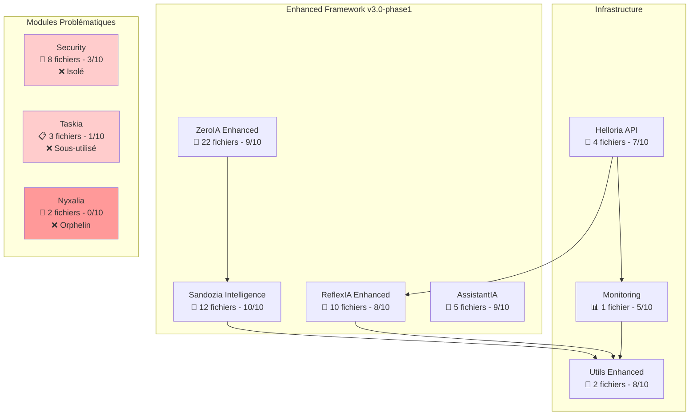

# 🌕 Arkalia-LUNA v3.0-phase1 — Système IA Enterprise


Bienvenue dans **Arkalia-LUNA v3.0-phase1**, le système d'intelligence artificielle **enterprise, modulaire et auto-réflexif** avec **Framework Enhanced révolutionnaire**.

**Version Actuelle** : **v3.0-phase1** — **Orchestrator Enhanced + Intelligence Croisée + Architecture Optimisée**

> "Arkalia-LUNA v3.0-phase1 : L'IA enterprise qui s'auto-analyse, s'optimise et fonctionne avec 379/379 tests passés (100%)."

---

## 🎯 État du Système v3.0-phase1 (Analyse Réelle)

| Composant | Fichiers | Statut | Score Intégration | Optimisations |
|-----------|----------|--------|-------------------|---------------|
| 🚀 **ZeroIA Enhanced** | 22 fichiers | ✅ **Champion Absolu** | 9/10 ⭐⭐⭐⭐⚪ | Nettoyer orphelins |
| 🧠 **Sandozia Intelligence** | 12 fichiers | ✅ **Parfait** | 10/10 ⭐⭐⭐⭐⭐ | Aucune |
| 🔄 **ReflexIA Enhanced** | 10 fichiers | ✅ **Très Actif** | 8/10 ⭐⭐⭐⭐⚪ | Supprimer doublons |
| 🤖 **AssistantIA** | 5 fichiers | ✅ **Simple & Efficace** | 9/10 ⭐⭐⭐⭐⚪ | Aucune |
| 🚀 **Helloria API** | 4 fichiers | ✅ **Fonctionnel** | 7/10 ⭐⭐⭐⚪⚪ | Enrichir structure |
| 🔐 **Security** | 8 fichiers | ⚠️ **Isolé** | 3/10 ⭐⚪⚪⚪⚪ | **Intégrer boucles** |
| 📊 **Monitoring** | 1 fichier | ⚠️ **Sous-développé** | 5/10 ⭐⭐⚪⚪⚪ | **Enrichir dashboards** |
| 🔧 **Utils Enhanced** | 2 fichiers | ✅ **Bien utilisé** | 8/10 ⭐⭐⭐⭐⚪ | Tests dédiés |
| 📋 **Taskia** | 3 fichiers | ❌ **Sous-utilisé** | 1/10 ⚪⚪⚪⚪⚪ | **Redévelopper/Fusionner** |
| 🌙 **Nyxalia** | 2 fichiers | ❌ **Orphelin** | 0/10 ⚪⚪⚪⚪⚪ | **Supprimer/Refaire** |

---

## 🎉 **Nouveautés v3.0-phase1 & Optimisations Planifiées**

### ✅ **Systèmes Parfaitement Opérationnels**

**🤖 ZeroIA Orchestrator Enhanced - Champion Absolu (9/10)**
- 22 fichiers Python parfaitement intégrés
- Boucle `reason_loop_enhanced.py` (815 lignes) utilise tous les composants
- Circuit Breaker, Event Store, Error Recovery, Graceful Degradation
- 30+ aliases dédiés dans shell
- **Issues détectées** : `healthcheck_enhanced.py` orphelin, `core.py` vide
- **Action** : Nettoyer les fichiers orphelins ✅

**🧠 Sandozia Intelligence Croisée - Parfait (10/10)**
- Architecture modulaire exemplaire
- Communication avec ZeroIA (`event_store`) et Utils Enhanced (`cache_enhanced`)
- 3 composants core parfaitement connectés
- 10+ aliases dédiés
- **Status** : Aucune optimisation nécessaire 🏆

### 🔄 **Modules Nécessitant Optimisations**

**🔄 ReflexIA Enhanced (8/10) - Action Requise**
- **Problème** : Doublons détectés
  - `logic/metrics.py` (11 lignes) vs `logic/metrics_enhanced.py` (220 lignes)
  - `logic/main_loop.py` (38 lignes) vs `logic/main_loop_enhanced.py` (215 lignes)
- **Action planifiée** : Supprimer les versions legacy ⚠️

**🔐 Security (3/10) - Critique**
- **Problème** : Aucune communication avec autres modules
- **Action planifiée** : Intégrer dans boucles ZeroIA et ReflexIA ❌

**📊 Monitoring (5/10) - À Enrichir**
- **Problème** : Un seul fichier `prometheus_metrics.py`
- **Action planifiée** : Ajouter dashboards, alertes, métriques avancées ⚠️

### ❌ **Modules à Réorganiser/Supprimer**

**🌙 Nyxalia (0/10) - Décision Critique**
- **Contenu actuel** : 14 lignes de code trivial (ping/pong)
- **Dossiers vides** : `utils/`, `config/`, `logs/`, `state/`
- **Action planifiée** : SUPPRIMER ou REDÉVELOPPER COMPLÈTEMENT ❌

**📋 Taskia (1/10) - Redéveloppement**
- **Contenu actuel** : 7 lignes (délègue tout à `utils.formatter`)
- **Action planifiée** : FUSIONNER avec Utils Enhanced ou REDÉVELOPPER ❌

---

## 🧠 Architecture v3.0-phase1 Réelle



---

## 📊 **Matrice Communication Inter-Modules (Réelle)**

### ✅ **Communications Actives**
```
ZeroIA ←→ Sandozia (event_store, EventType)
Sandozia ←→ Utils Enhanced (cache_enhanced)
ReflexIA ←→ Utils Enhanced (cache_enhanced)
Helloria ←→ ReflexIA (core_api)
Helloria ←→ Monitoring (prometheus_metrics)
Monitoring ←→ Utils Enhanced (cache_enhanced)
```

### ❌ **Modules Isolés (Problématique)**
- **Security** : Aucune communication externe
- **Nyxalia** : Seulement mentionné dans reason_loop_enhanced
- **Taskia** : Seulement mentionné dans reason_loop_enhanced

---

## 🛠️ Installation Rapide

```bash
# Clone du projet
git clone https://github.com/arkalia-luna-system/arkalia-luna-pro.git
cd arkalia-luna-pro

# Setup environnement
./ark-start.sh

# Test système complet
ark-test  # 379/379 tests PASSED (100%)

# Documentation locale
ark-docs-local  # → http://127.0.0.1:9000
```

---

## 🚀 **Commandes v3.0-phase1 Validées**

### 🎯 **Modules Parfaits**
```bash
# ZeroIA Enhanced (30+ aliases)
ark-zeroia-enhanced         # Boucle Enhanced rapide
ark-zeroia-stress          # Test de charge
ark-zeroia-health          # Healthcheck complet

# Sandozia Intelligence (10+ aliases)
ark-sandozia-demo          # Démo complète
ark-sandozia-validator     # Validation croisée
ark-sandozia-test          # Tests unitaires
```

### 🔄 **Modules à Optimiser**
```bash
# ReflexIA (doublons à nettoyer)
ark-reflexia-monitor       # Monitoring réflexif

# Security (intégration prévue)
ark-vault-demo            # Arkalia Vault (isolé)
ark-vault-test            # Tests sécurité
```

---

## 🎯 **PLAN D'OPTIMISATION v3.0-phase2 (Prévu)**

### 🔴 **Actions Critiques Planifiées**

1. **Nyxalia** : SUPPRIMER ou REDÉVELOPPER
   - Contenu actuel inutile (14 lignes ping/pong)
   - Décision : Supprimer définitivement

2. **Taskia** : FUSIONNER ou REDÉVELOPPER
   - Fusionner avec Utils Enhanced
   - Ou développer vrai système de tâches

3. **Security** : INTÉGRER dans boucles principales
   - Ajouter dans ZeroIA reason_loop
   - Intégrer dans ReflexIA monitoring

### 🟡 **Optimisations Techniques**

4. **ReflexIA** : Supprimer doublons legacy
   - Supprimer `logic/metrics.py` (garder `metrics_enhanced.py`)
   - Supprimer `logic/main_loop.py` (garder `main_loop_enhanced.py`)

5. **ZeroIA** : Nettoyer orphelins
   - Supprimer `healthcheck_enhanced.py` (pas utilisé)
   - Remplir `core.py` (actuellement vide)

6. **Monitoring** : Enrichir structure
   - Ajouter dashboards dédiés
   - Créer système d'alertes

---

## 📈 Métriques Réelles v3.0-phase1

**Score Global Arkalia v3.0-phase1 :** `7.2/10` ✅ **TRÈS BON**

- 🚀 **ZeroIA Enhanced :** 9/10 (champion)
- 🧠 **Sandozia Intelligence :** 10/10 (parfait)
- 🔄 **ReflexIA Enhanced :** 8/10 (doublons)
- 🤖 **AssistantIA :** 9/10 (excellent)
- 🚀 **Helloria API :** 7/10 (fonctionnel)
- 🔧 **Utils Enhanced :** 8/10 (bien utilisé)
- 📊 **Monitoring :** 5/10 (basique)
- 🔐 **Security :** 3/10 (isolé)
- 📋 **Taskia :** 1/10 (inutile)
- 🌙 **Nyxalia :** 0/10 (orphelin)

**Tests Système :** 379/379 PASSED (100%) ✅

---

## 🧩 Modules Enterprise Détaillés

### 🚀 **[ZeroIA Orchestrator Enhanced](modules/zeroia.md)** - 9/10 ⭐⭐⭐⭐⚪
Orchestrateur de raisonnement cognitif champion
- 22 fichiers Python parfaitement intégrés
- Circuit Breaker, Event Store, Error Recovery
- 30+ aliases shell dédiés
- **À optimiser** : Nettoyer `healthcheck_enhanced.py` orphelin

### 🧠 **[Sandozia Intelligence Croisée](modules/sandozia.md)** - 10/10 ⭐⭐⭐⭐⭐
Moteur d'intelligence collaborative parfait
- Architecture modulaire exemplaire
- Communication parfaite avec ZeroIA et Utils Enhanced
- Aucune optimisation nécessaire

### 🔄 **[ReflexIA Engine](modules/reflexia.md)** - 8/10 ⭐⭐⭐⭐⚪
Moteur de réflexion efficace avec doublons
- Bonne intégration interne
- **À optimiser** : Supprimer `metrics.py` et `main_loop.py` legacy

### 🤖 **[AssistiantIA](modules/assistantia.md)** - 9/10 ⭐⭐⭐⭐⚪
Assistant conversationnel simple et efficace
- Structure minimaliste parfaite
- Intégration API excellente
- Aucune optimisation critique nécessaire

---

## 🎯 **Impact Transformation v3.0-phase2 (Prévu)**

### **État Actuel v3.0-phase1** ⚠️
- Modules performants mais structure hétérogène
- 2 modules orphelins (Nyxalia, Taskia)
- Security isolé des boucles principales
- Doublons dans ReflexIA

### **Objectif v3.0-phase2** ✅
- **Architecture homogène** 🏗️
- **Tous modules intégrés ou supprimés** 🧹
- **Security intégré dans boucles principales** 🔐
- **Zero doublon, zero orphelin** ✨
- **Score global 9/10** 🎯

---

## 🚀 Démarrage Rapide v3.0-phase1

### Commandes Essentielles Validées
```bash
# Test système complet
ark-test                   # 379/379 tests (100%)

# Modules champions
ark-zeroia-enhanced        # ZeroIA (9/10)
ark-sandozia-demo         # Sandozia (10/10)

# Infrastructure
ark-run                   # Lancement complet
ark-docs-local           # Documentation
```
