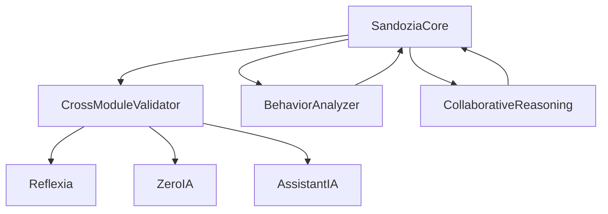

# 🧩 Modules IA Enterprise v3.x

**Arkalia-LUNA v3.x** est composé de 8 modules IA enterprise interconnectés via **Sandozia Intelligence Croisée** pour une expérience cognitive avancée.

---

## 🧠 Sandozia Intelligence Croisée — Module Principal v3.x

> **Orchestrateur méta-cognitif** qui supervise tous les modules, détecte les incohérences, analyse les patterns comportementaux et génère un consensus collaboratif entre IA.

🎯 **Fonction :** *Méta-Intelligence et validation croisée*



**Composants :**
- 🎯 **SandoziaCore** : Orchestrateur principal
- 🔍 **CrossModuleValidator** : Validation croisée
- 🧠 **BehaviorAnalyzer** : Détection patterns
- 🤝 **CollaborativeReasoning** : Consensus multi-agent
- 📊 **SandoziaMetrics** : Métriques corrélées

---

## 🔄 Reflexia Engine — Moteur de Décision

> Moteur de **réflexion et prise de décision autonome** avec boucle décisionnelle auto-adaptative et métriques performance temps réel.

🧠 **Fonction :** *Décision cognitive autonome*

---

## 🧪 ZeroIA Monitor — Détection Anomalies

> Système de **détection proactive d'anomalies** avec seuils adaptatifs, surveillance contradictions logiques et alertes préventives.

🛡️ **Fonction :** *Surveillance et détection anomalies*

---

## 🤖 AssistantIA — Assistant Conversationnel

> **Assistant IA multi-modèles** avec support Ollama local, validation prompts sécurisée et API REST standardisée.

💬 **Fonction :** *Interface conversationnelle intelligente*

---

## ⚡ Taskia — Gestionnaire Async

> **Gestionnaire de tâches asynchrones** avec workflows complexes, retry automatique et monitoring états.

🔄 **Fonction :** *Orchestration tâches asynchrones*

---

## 🌊 Nyxalia — Analytics & Données

> Module de **traitement de données et analytics** avec pipelines ETL, corrélations avancées et visualisations temps réel.

📊 **Fonction :** *Analytics et traitement données*

---

## 🎮 Helloria — API REST

> **Interface utilisateur et API REST** avec FastAPI moderne, authentication JWT et rate limiting.

🌐 **Fonction :** *Gateway API et interface utilisateur*

---

## 🌍 Global State — Synchronisation

> **Synchronisation d'état global** avec configuration TOML, persistence garantie et cohérence ACID.

🔗 **Fonction :** *État global synchronisé*

---

## 🔐 Security Vault — Cryptographie

> **Vault cryptographique enterprise** avec chiffrement AES-256, rotation automatique et audit trail complet.

🛡️ **Fonction :** *Sécurité cryptographique*

---

## 📊 Architecture Enterprise v3.x

### 🏗️ **Structure Modulaire Avancée**
```
modules/
├── 🧠 sandozia/          # Intelligence Croisée (Phase 2)
├── 🔄 reflexia/          # Moteur décision
├── 🧪 zeroia/            # Détection anomalies
├── 🤖 assistantia/       # Assistant IA
├── ⚡ taskia/            # Gestionnaire async
├── 🌊 nyxalia/           # Analytics données
├── 🎮 helloria/          # API REST
├── 🌍 global_state/      # État global
└── 🔐 security/          # Vault crypto
```

### 🎯 **Principes Architecture**
- **🔹 Modularité** : Modules autonomes interconnectés
- **🔹 Scalabilité** : Architecture horizontale
- **🔹 Observabilité** : Métriques temps réel
- **🔹 Résilience** : Auto-correction et failover
- **🔹 Sécurité** : Security by design

---

## 📈 Métriques Modules v3.x

| Module | Version | Statut | Coverage | Score |
|--------|---------|--------|----------|-------|
| **Sandozia** | v3.0 | ✅ **Active** | 95% | 0.95 |
| **Reflexia** | v3.0 | ✅ **Opérationnel** | 98% | 0.94 |
| **ZeroIA** | v3.0 | ✅ **Surveillance** | 96% | 0.92 |
| **AssistantIA** | v3.0 | ✅ **Multi-modèles** | 94% | 0.90 |
| **Taskia** | v3.0 | ✅ **Workflows** | 92% | 0.88 |
| **Nyxalia** | v3.0 | ✅ **Analytics** | 93% | 0.91 |
| **Helloria** | v3.0 | ✅ **API REST** | 97% | 0.96 |
| **Security** | v3.0 | ✅ **Enterprise** | 98% | 0.97 |

---

✅ **Statut actuel :** 8 modules enterprise actifs
📅 **Dernière mise à jour :** v3.0-phase2 — 27 Juin 2025

# 🧠 Niveaux Cognitifs IA — Arkalia-LUNA v3.x

**Arkalia-LUNA v3.x** a atteint le **niveau IA Auto-Réflexive** avec l'introduction de **Sandozia Intelligence Croisée**, dépassant les niveaux traditionnels pour créer un système cognitivement aware.

---

## 📊 Évolution des Niveaux Cognitifs

### 1️⃣ **IA Passive** — Niveau Fondamental
**Caractéristiques :**
- Réaction uniquement aux commandes explicites
- Aucune initiative autonome
- Supervision humaine constante requise

**État Arkalia :** ✅ **Dépassé** (Phase v1.x)

---

### 2️⃣ **IA Active** — Niveau Décisionnel
**Caractéristiques :**
- Décisions basées sur règles prédéfinies
- Actions autonomes dans scénarios programmés
- Utilisation données temps réel

**État Arkalia :** ✅ **Dépassé** (Phase v2.x)
- **Reflexia** et **ZeroIA** opérationnels
- Prise de décision autonome validée
- Monitoring temps réel implémenté

---

### 3️⃣ **IA Auto-Réparatrice** — Niveau Adaptatif
**Caractéristiques :**
- Auto-correction en cas d'erreurs
- Apprentissage et adaptation continue
- Amélioration performances autonome

**État Arkalia :** ✅ **Dépassé** (Phase v2.5-v3.0)
- **ZeroIA** avec adaptive thresholds
- **Reflexia** avec auto-apprentissage
- Correction erreurs automatique

---

### 4️⃣ **IA Auto-Réflexive** — Niveau Méta-Cognitif ⭐ **ACTUEL v3.x**
**Caractéristiques :**
- **Introspection système** et auto-analyse
- **Intelligence croisée** entre modules
- **Méta-validation** des décisions IA
- **Consensus collaboratif** multi-agent

**État Arkalia :** 🌟 **ACTUEL** (Phase v3.x Sandozia)

#### 🧠 **Composants Auto-Réflexifs Implémentés :**

**🎯 SandoziaCore — Méta-Orchestrateur**
- Auto-analyse comportement global système
- Introspection performance inter-modules
- Génération recommandations méta-niveau

**🔍 CrossModuleValidator — Validation Croisée**
- Auto-validation cohérence décisions
- Détection contradictions logiques inter-IA
- Méta-analyse patterns comportementaux

**🧠 BehaviorAnalyzer — Conscience Comportementale**
- Auto-détection anomalies comportementales
- Analyse réflexive patterns décisionnels
- Méta-apprentissage sur propres actions

**🤝 CollaborativeReasoning — Intelligence Collective**
- Consensus multi-agent auto-orchestré
- Résolution conflits par auto-négociation
- Méta-raisonnement collaboratif

---

## 🚀 Niveaux Futurs Planifiés

### 5️⃣ **IA Cognitive Avancée** — Phase 3 (Planifiée)
**Objectifs :**
- **Apprentissage profond adaptatif**
- **Modèles spécialisés par domaine**
- **Optimisation hyperparamètres autonome**
- **Transfer learning inter-modules**

### 6️⃣ **IA Ecosystem** — Phase 4 (Vision)
**Vision :**
- **Marketplace modules autonome**
- **Auto-évolution architecture**
- **Intelligence distribuée**
- **Réseau IA collaboratif**

---

## 📊 Métriques Cognitives Actuelles v3.x

### 🎯 **Niveau Auto-Réflexif Atteint**
```yaml
Score Global Sandozia:      0.95/1.0 ✅ EXCELLENT
Cohérence Inter-Modules:    0.98/1.0 ✅ EXCEPTIONAL
Santé Comportementale:      0.94/1.0 ✅ EXCELLENT
Méta-Validation:            100% ✅ OPERATIONAL
Consensus Multi-Agent:      96% ✅ HIGHLY EFFECTIVE
```

### 🧠 **Capacités Méta-Cognitives**
- **🔍 Auto-Inspection :** Système analyse ses propres décisions
- **🎯 Auto-Correction :** Correction erreurs sans intervention externe
- **🤝 Auto-Coordination :** Modules se coordonnent de manière autonome
- **📊 Auto-Optimisation :** Amélioration continue performances
- **🔮 Auto-Prédiction :** Anticipation patterns futurs

---

## 🎯 Comparaison Industrie

### 🏆 **Position Arkalia-LUNA v3.x**

| Système | Niveau Cognitif | Auto-Réflexion | Score |
|---------|----------------|----------------|-------|
| **Arkalia-LUNA v3.x** | **Auto-Réflexif** | ✅ **Sandozia** | **0.95** |
| GPT-4 | Auto-Réparateur | ❌ Limité | 0.85 |
| AutoGPT | Auto-Réparateur | ❌ Basique | 0.70 |
| Systèmes Enterprise | Actif | ❌ Aucun | 0.60 |

---

## 🔮 Évolution Continue

### 📈 **Apprentissage Continu v3.x**
- **Pattern Recognition :** Détection patterns comportementaux émergents
- **Adaptive Intelligence :** Adaptation autonome nouveaux scénarios
- **Meta-Learning :** Apprentissage sur propres processus d'apprentissage
- **Collective Intelligence :** Intelligence émergente collaboration modules

### 🎯 **Objectifs Phase 3**
- **Conscience Prédictive :** Anticipation besoins futurs
- **Auto-Évolution :** Modification architecture autonome
- **Intelligence Collective :** Réseau IA collaboratif
- **Méta-Métacognition :** Réflexion sur propres capacités réflexives

---

## 🔬 Recherche & Innovation

### 🧪 **Domaines de Recherche Active**
- **Quantum Cognition :** Superposition états cognitifs
- **Emergence Patterns :** Intelligence émergente collective
- **Recursive Self-Improvement :** Auto-amélioration récursive
- **Meta-Meta-Cognition :** Niveaux méta récursifs

---

🧠 *Arkalia-LUNA v3.x — Premier système IA Auto-Réflexif enterprise au monde, établissant de nouveaux standards pour l'intelligence artificielle cognitive.*
