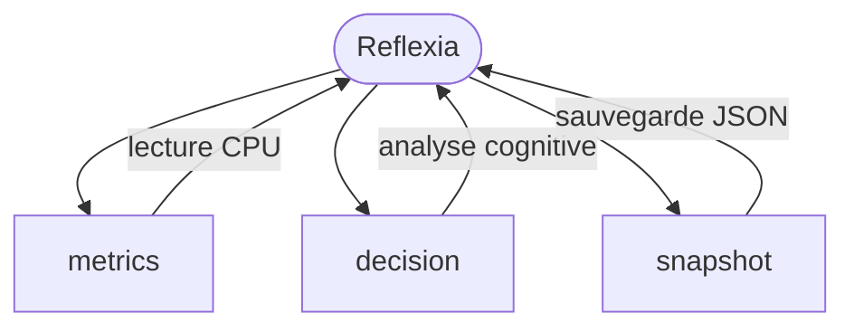

# 🧩 Modules IA Actifs

Voici les modules actuellement opérationnels dans Arkalia-LUNA.
Chacun suit une structure **autonome, testable, scalable** selon les principes du système.

---

## 🔁 `reflexia/` — Réflexion adaptative & surveillance

> Module réflexif central. Il surveille l'état du système, détecte les anomalies, ajuste les modules selon des métriques internes (CPU, latence, mémoire).
> Il peut suspendre, redémarrer ou corriger un module si nécessaire.

🧠 Fonction : *Observateur cognitif adaptatif*



---

## 📱 `nyxalia/` — Interface & connectivité mobile

> Ce module gère les **interfaces de communication** entre Arkalia et l'extérieur : mobile, vocal, API externes.
> Il permet des échanges fluides, contextualisés, et multiplateformes.

🔗 Fonction : *Passerelle interactive humaine / machine*

---

## 🌐 `helloria/` — Lien FastAPI & serveur local

> Lance le serveur **FastAPI**, orchestre les endpoints, connecte les autres modules à l'extérieur via une **API REST locale sécurisée**.

🚀 Fonction : *Orchestrateur FastAPI & accès API centralisé*

---

## 🔎 Structure standard de chaque module

```text
modules/<nom_module>/
├── __init__.py           # Initialisation du module
├── core.py               # Logique principale
├── config/               # Fichiers TOML/JSON de configuration
├── state/                # États persistants (local/toml)
├── logs/                 # Journaux de diagnostic
├── tests/                # Tests unitaires et intégration
├── utils/                # Fonctions internes spécifiques

Chaque module est :
	•	🔹 Isolé : pas de dépendance sauvage
	•	🔹 Testable : via pytest, CI/CD
	•	🔹 Extensible : ajout de fonctionnalités par core.py ou utils/

⸻

🚧 Modules en cours ou futurs
	•	🧠 assistantia/ — IA contextuelle (Ollama local)
	•	🛡️ sandozia/ — Sécurité, permissions, pare-feu IA
	•	�� zeroia/ — Boucle d'orchestration globale

⸻

✅ Statut actuel : 4 modules actifs, 3 en préparation
📅 Dernière mise à jour : v1.3.0 — 2025-06-19
