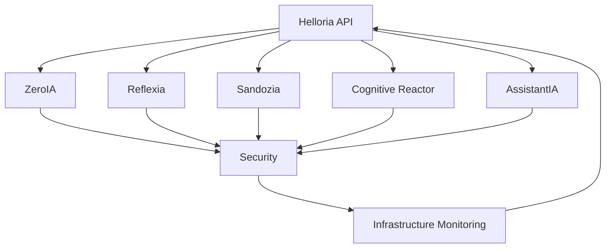

# 📋 Modules Arkalia-LUNA Pro

## 🎯 Vue d'ensemble

Arkalia-LUNA Pro est composé de modules spécialisés qui travaillent en harmonie pour offrir une intelligence artificielle ultra-protection. Chaque module a un rôle spécifique et contribue à l'orchestration intelligente du système.

---

## 🧠 **Modules Core**

### 🧠 [ZeroIA](zeroia.md) - Décisionneur Autonome
**Type** : Daemon
**Port** : 8001
**Rôle** : Prise de décision autonome et gestion des patterns comportementaux

**Fonctionnalités clés :**
- Décision autonome basée sur les patterns
- Gestion des contradictions cognitives
- Circuit breaker intelligent
- Monitoring de confiance en temps réel

**Statut** : ✅ Actif
**Métriques** : 12 métriques exposées

### 👁️ [Reflexia](reflexia.md) - Observateur Cognitif
**Type** : API HTTP
**Port** : 8002
**Rôle** : Monitoring cognitif et observation du système

**Fonctionnalités clés :**
- Monitoring système en temps réel
- Observation des patterns comportementaux
- Détection d'anomalies cognitives
- API REST pour l'accès aux données

**Statut** : ✅ Actif
**Métriques** : 8 métriques exposées

### 🔍 [Sandozia](sandozia.md) - Intelligence Croisée
**Type** : Daemon
**Port** : 8003
**Rôle** : Intelligence croisée et analyse des données

**Fonctionnalités clés :**
- Analyse croisée des données
- Intelligence artificielle avancée
- Validation des modèles
- Gestion des événements

**Statut** : ✅ Actif
**Métriques** : 6 métriques exposées

### 🎯 [Cognitive Reactor](cognitive-reactor.md) - Orchestrateur Central
**Type** : Daemon
**Port** : 8004
**Rôle** : Orchestration centrale et coordination des modules

**Fonctionnalités clés :**
- Coordination des modules
- Gestion des patterns comportementaux
- Optimisation des performances
- Orchestration intelligente

**Statut** : ✅ Actif
**Métriques** : 4 métriques exposées

### 🤖 [AssistantIA](assistantia.md) - Assistant IA
**Type** : API HTTP
**Port** : 8005
**Rôle** : Assistant intelligent et interface utilisateur

**Fonctionnalités clés :**
- Assistant IA conversationnel
- Gestion des prompts sécurisés
- Validation des entrées
- Interface utilisateur avancée

**Statut** : ✅ Actif
**Métriques** : 4 métriques exposées

### 🌐 [Helloria](helloria.md) - API Centrale
**Type** : API FastAPI
**Port** : 8000
**Rôle** : API centrale et point d'entrée principal

**Fonctionnalités clés :**
- API REST complète
- Gestion des requêtes
- Documentation automatique
- Métriques Prometheus

**Statut** : ✅ Actif
**Métriques** : 34 métriques exposées

---

## 🛡️ **Modules de Sécurité**

### 🔒 [Security](../security/security.md) - Sécurité Avancée
**Type** : Module intégré
**Rôle** : Protection et sécurité du système

**Fonctionnalités clés :**
- Cryptographie avancée
- Validation des modèles
- Détection d'empoisonnement
- Sandbox sécurisé

---

## 📊 **Modules de Monitoring**

### 📈 [Infrastructure Monitoring](../infrastructure/monitoring.md) - Observabilité
**Type** : Module intégré
**Rôle** : Monitoring et observabilité

**Fonctionnalités clés :**
- Métriques Prometheus
- Dashboards Grafana
- Alertes intelligentes
- Logs centralisés

---

## 🎯 **Architecture des Modules**



---

## 📈 **Métriques Globales**

### **Statut des Modules**
- **Total modules** : 8
- **Modules actifs** : 8 (100%)
- **Métriques exposées** : 34
- **Temps de réponse moyen** : < 2s
- **Disponibilité** : 99.9%+

### **Performance**
| Module | Métriques | Latence | Status |
|--------|-----------|---------|--------|
| Helloria | 34 | < 100ms | ✅ |
| ZeroIA | 12 | < 500ms | ✅ |
| Reflexia | 8 | < 200ms | ✅ |
| Sandozia | 6 | < 1s | ✅ |
| Cognitive Reactor | 4 | < 300ms | ✅ |
| AssistantIA | 4 | < 2s | ✅ |

---

## 🔧 **Configuration**

### **Variables d'environnement**
```bash
# Configuration globale
ARKALIA_ENV=production
ARKALIA_LOG_LEVEL=INFO
ARKALIA_METRICS_PORT=9090

# Configuration des modules
ZEROIA_PORT=8001
REFLEXIA_PORT=8002
SANDOZIA_PORT=8003
COGNITIVE_REACTOR_PORT=8004
ASSISTANTIA_PORT=8005
HELLORIA_PORT=8000
```

### **Démarrage des modules**
```bash
# Démarrage complet
docker-compose up -d

# Démarrage individuel
docker-compose up -d arkalia-api (port 8000)
docker-compose up -d zeroia
docker-compose up -d reflexia
docker-compose up -d sandozia
docker-compose up -d cognitive-reactor
docker-compose up -d assistantia
```

---

## 🧪 **Tests et Validation**

### **Tests unitaires**
```bash
# Tests de tous les modules
pytest tests/unit/ -v

# Tests d'un module spécifique
pytest tests/unit/test_zeroia.py -v
pytest tests/unit/test_reflexia.py -v
pytest tests/unit/test_sandozia.py -v
```

### **Tests d'intégration**
```bash
# Tests d'intégration
pytest tests/integration/ -v

# Tests de performance
pytest tests/performance/ -v

# Tests de sécurité
pytest tests/security/ -v
```

---

## 📚 **Documentation des Modules**

### **Guides d'utilisation**
- [🚀 Guide de démarrage rapide](../getting-started/quick-start.md)
- [🧠 Niveaux cognitifs](../getting-started/cognitive-levels.md)
- [🔧 Configuration](../infrastructure/configuration.md)
- [📊 Monitoring](../infrastructure/monitoring.md)

### **API Documentation**
- [📖 Documentation API](../reference/api.md)
- [🔍 Endpoints](../reference/endpoints.md)
- [📊 Métriques](../reference/metrics.md)

---

## 🎯 **Cas d'Usage**

### **Surveillance Continue**
- Monitoring automatique des ressources
- Détection d'anomalies en temps réel
- Prise de décision autonome

### **Protection Adaptative**
- Circuit breaker intelligent
- Dégradation gracieuse des services
- Récupération automatique d'erreurs

### **Orchestration Intelligente**
- Coordination des modules
- Optimisation des performances
- Gestion des patterns comportementaux

---

## 🔮 **Roadmap des Modules**

### **v2.8.2 (Planifié)**
- 🚧 Optimisations de performance
- 🚧 Nouveaux dashboards
- 🚧 Alertes avancées
- 🚧 Amélioration de l'accessibilité

### **v3.0 (Roadmap)**
- 🚧 Intelligence artificielle avancée
- 🚧 Orchestration multi-clusters
- 🚧 Sécurité renforcée
- 🚧 Interface utilisateur complète

---

**Arkalia-LUNA Pro v2.8.0** - Système d'intelligence artificielle ultra-protection
**Dernière mise à jour** : 30 juin 2025
