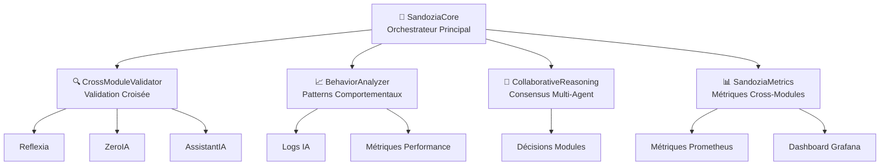

# 🧠 Sandozia Intelligence Croisée

**Phase 2 v3.x - Intelligence Collaborative Multi-Agent**

Sandozia est le système d'intelligence croisée d'Arkalia-LUNA qui coordonne et analyse la cohérence entre les différents modules IA.

## 🎯 Vision Stratégique

Sandozia transforme Arkalia-LUNA d'un ensemble de modules IA indépendants vers un **système d'intelligence collaborative** capable de :

- **Auto-auditer** ses propres décisions
- **Détecter** les incohérences inter-modules
- **Résoudre** les conflits par consensus
- **Apprendre** de ses erreurs collectivement

## 🏗️ Architecture



## 🧩 Modules

### 🧠 SandoziaCore
**Orchestrateur principal** de l'intelligence croisée.

**Fonctionnalités :**
- Collecte snapshots d'intelligence globale
- Coordination monitoring temps réel
- Gestion cycle de vie des analyses
- Sauvegarde état système

**Points d'entrée :**
```python
from modules.sandozia.core.sandozia_core import SandoziaCore

# Initialisation
sandozia = SandoziaCore()
await sandozia.initialize_modules()

# Collecte snapshot
snapshot = await sandozia.collect_intelligence_snapshot()

# Monitoring continu
await sandozia.start_monitoring()
```

### 🔍 CrossModuleValidator
**Validation de cohérence** entre modules IA.

**Types de validation :**
- **Temporelle** : Synchronisation des timestamps
- **Logique** : Détection contradictions
- **Confiance** : Cohérence des scores
- **Comportementale** : Patterns suspects

**Exemple d'utilisation :**
```python
from modules.sandozia.validators.crossmodule import CrossModuleValidator

validator = CrossModuleValidator()
result = validator.run_full_validation()

print(f"Score cohérence: {result['coherence_score']:.3f}")
print(f"Issues détectées: {result['total_validations']}")
```

### 📈 BehaviorAnalyzer
**Détection de patterns** comportementaux aberrants.

**Analyses :**
- **Anomalies statistiques** (z-score > seuil)
- **Régressions performance** (dégradation temporelle)
- **Patterns décisionnels** (répétitions suspectes)
- **Corrélations anormales** (divergences modules)

**Utilisation :**
```python
from modules.sandozia.analyzer.behavior import BehaviorAnalyzer

analyzer = BehaviorAnalyzer()

# Ajouter métriques
analyzer.add_metric_sample("reflexia", "confidence_score", 0.85)
analyzer.add_decision_event("zeroia", {"decision": "monitor", "confidence": 0.78})

# Analyser
result = analyzer.analyze_behavior()
print(f"Santé comportementale: {result['behavioral_health_score']:.3f}")
```

### 🤝 CollaborativeReasoning
**Raisonnement collaboratif** multi-agent.

**Processus :**
1. **Collecte** raisonnements de chaque module
2. **Analyse** désaccords et convergences
3. **Calcul** consensus pondéré
4. **Résolution** conflits par vote

**Exemple :**
```python
from modules.sandozia.reasoning.collaborative import CollaborativeReasoning

collaborative = CollaborativeReasoning()

decisions = {
    "reflexia": {"decision": "monitor", "confidence": 0.85, "reasoning": "CPU normal"},
    "zeroia": {"decision": "reduce", "confidence": 0.75, "reasoning": "Contradiction détectée"},
    "assistantia": {"decision": "monitor", "confidence": 0.80, "reasoning": "Utilisateur calme"}
}

result = collaborative.run_collaborative_reasoning(decisions)
print(f"Consensus: {result['consensus_result']['consensus_reached']}")
print(f"Décision finale: {result['consensus_result']['final_decision']}")
```

### 📊 SandoziaMetrics
**Métriques et corrélations** cross-modules.

**Capacités :**
- Collecte métriques temporelles
- Calcul corrélations Pearson
- Export Prometheus/Grafana
- Santé cross-modules

**API :**
```python
from modules.sandozia.utils.metrics import SandoziaMetrics

metrics = SandoziaMetrics(retention_hours=24)

# Ajouter métriques
metrics.add_metric("reflexia_confidence", 0.85, {"module": "reflexia"})
metrics.add_metric("zeroia_confidence", 0.78, {"module": "zeroia"})

# Corrélation
correlation = metrics.calculate_correlation("reflexia_confidence", "zeroia_confidence")
print(f"Corrélation: {correlation:.3f}")

# Santé globale
health = metrics.get_cross_module_health()
print(f"Cohérence: {health['cross_module_coherence']:.3f}")
```

## 🔧 Configuration

**Fichier :** `modules/sandozia/config/sandozia_config.toml`

```toml
[monitoring]
interval_seconds = 30
coherence_threshold = 0.85
anomaly_threshold = 0.15
max_history_size = 1000

[modules]
reflexia_enabled = true
zeroia_enabled = true
assistant_enabled = true

[alerting]
coherence_alert_threshold = 0.70
behavioral_alert_enabled = true

[correlation]
time_window_minutes = 15
confidence_threshold = 0.75
max_correlations = 100

[reasoning]
enable_cross_validation = true
reasoning_history_size = 500
consensus_threshold = 0.80
```

## 🚀 Utilisation

### CLI Direct
```bash
# Démonstration complète
python scripts/demo_sandozia.py --full-demo

# Modules individuels
python scripts/demo_sandozia.py --validator-only
python scripts/demo_sandozia.py --analyzer-only
python scripts/demo_sandozia.py --core-only

# Monitoring temps réel
python -m modules.sandozia.core.sandozia_core --start

# Statut
python -m modules.sandozia.core.sandozia_core --status
```

### Aliases ZSH
```bash
# 🧠 Sandozia Intelligence Croisée
ark-sandozia-demo          # Démonstration complète
ark-sandozia-validator     # CrossModuleValidator uniquement
ark-sandozia-analyzer      # BehaviorAnalyzer uniquement
ark-sandozia-metrics       # SandoziaMetrics uniquement
ark-sandozia-core          # SandoziaCore uniquement
ark-sandozia-clean         # Nettoyer fichiers demo
ark-sandozia-test          # Tests unitaires
ark-sandozia-status        # Statut système
ark-sandozia-start         # Démarrer monitoring
```

### Intégration Python
```python
import asyncio
from modules.sandozia import SandoziaCore, CrossModuleValidator, BehaviorAnalyzer

async def main():
    # Orchestrateur principal
    sandozia = SandoziaCore()
    await sandozia.initialize_modules()

    # Validation croisée
    validator = CrossModuleValidator()
    validation_result = validator.run_full_validation()

    # Analyse comportementale
    analyzer = BehaviorAnalyzer()
    behavior_result = analyzer.analyze_behavior()

    # Snapshot global
    snapshot = await sandozia.collect_intelligence_snapshot()

    print(f"Cohérence système: {validation_result['coherence_score']:.3f}")
    print(f"Santé comportementale: {behavior_result['behavioral_health_score']:.3f}")

asyncio.run(main())
```

## 📊 Métriques et Monitoring

### Métriques Clés
- **`sandozia_coherence_score`** : Score de cohérence inter-modules (0.0-1.0)
- **`sandozia_behavioral_health`** : Santé comportementale globale (0.0-1.0)
- **`sandozia_cross_correlations`** : Nombre de corrélations actives
- **`sandozia_anomalies_detected`** : Anomalies détectées par cycle
- **`sandozia_consensus_rate`** : Taux de consensus collaboratif

### Dashboard Grafana
*(À implémenter Semaine 2)*

Panneaux prévus :
- **Intelligence Overview** : Scores globaux temps réel
- **Module Coherence** : Cohérence entre Reflexia/ZeroIA/AssistantIA
- **Behavioral Patterns** : Anomalies et régressions détectées
- **Collaborative Reasoning** : Historique consensus et désaccords
- **Cross-Correlations** : Matrices de corrélation dynamiques

## 🧪 Tests et Validation

### Tests Unitaires
```bash
# Tests complets Sandozia
ark-sandozia-test

# Tests spécifiques
pytest tests/unit/sandozia/test_crossmodule_validator.py -v
pytest tests/unit/sandozia/test_behavior_analyzer.py -v
pytest tests/unit/sandozia/test_collaborative_reasoning.py -v
```

### Tests d'Intégration
```bash
# Démonstration avec données synthétiques
ark-sandozia-demo

# Test performance
python -c "
import asyncio
from modules.sandozia.core.sandozia_core import SandoziaCore

async def perf_test():
    sandozia = SandoziaCore()
    await sandozia.initialize_modules()

    # 10 cycles de monitoring
    for i in range(10):
        snapshot = await sandozia.collect_intelligence_snapshot()
        print(f'Cycle {i+1}: Cohérence {snapshot.coherence_analysis[\"coherence_score\"]:.3f}')

asyncio.run(perf_test())
"
```

## 🔮 Roadmap Phase 2

### ✅ Semaine 1 (22-28 Juin) - **TERMINÉ**
- [x] SandoziaCore orchestrateur
- [x] CrossModuleValidator cohérence
- [x] BehaviorAnalyzer patterns
- [x] CollaborativeReasoning consensus
- [x] SandoziaMetrics corrélations
- [x] Démonstration end-to-end

### 🚀 Semaine 2 (29 Juin - 5 Juillet) - **EN COURS**
- [ ] Dashboard Grafana Intelligence Croisée
- [ ] Alertes Slack/Email incohérences critiques
- [ ] API REST endpoints Sandozia
- [ ] Optimisations performance

### ⏳ Semaine 3-4 (6-19 Juillet)
- [ ] ML patterns recognition avancé
- [ ] Tests stress + chaos engineering
- [ ] Documentation API complète
- [ ] Intégration CI/CD Sandozia

### 🎯 Semaine 5-8 (20 Juillet - 16 Août)
- [ ] Apprentissage automatique corrélations
- [ ] Prédiction dérives comportementales
- [ ] Auto-tuning seuils détection
- [ ] Rapports intelligence périodiques

## 💡 Avantages Stratégiques

### 🛡️ **Auditabilité Systémique**
Sandozia fournit une **trail d'audit complet** de toutes les décisions IA, permettant de comprendre **pourquoi** et **comment** le système a pris ses décisions.

### 🧠 **Intelligence Collaborative**
Au lieu d'IA isolées, Sandozia crée un **réseau d'intelligence** où chaque module peut apprendre des autres et améliorer collectivement les performances.

### ⚡ **Détection Proactive**
Les anomalies et dérives sont détectées **avant** qu'elles n'impactent les utilisateurs, permettant une maintenance prédictive.

### 🎯 **Gouvernance IA Responsable**
Foundation pour une IA explicable et responsable, essentielle pour la conformité réglementaire future.

## 🔗 Liens

- **Code source** : `modules/sandozia/`
- **Tests** : `tests/unit/sandozia/`
- **Configuration** : `modules/sandozia/config/`
- **Documentation API** : [À venir - Semaine 2]
- **Dashboard Grafana** : [À venir - Semaine 2]

---

**Sandozia Intelligence Croisée - Vers une IA Collaborative et Responsable** 🧠✨
