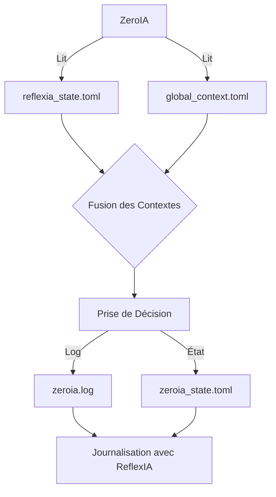
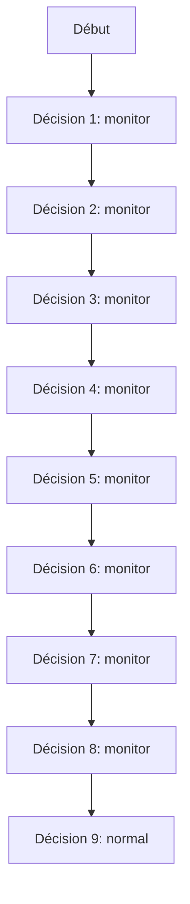
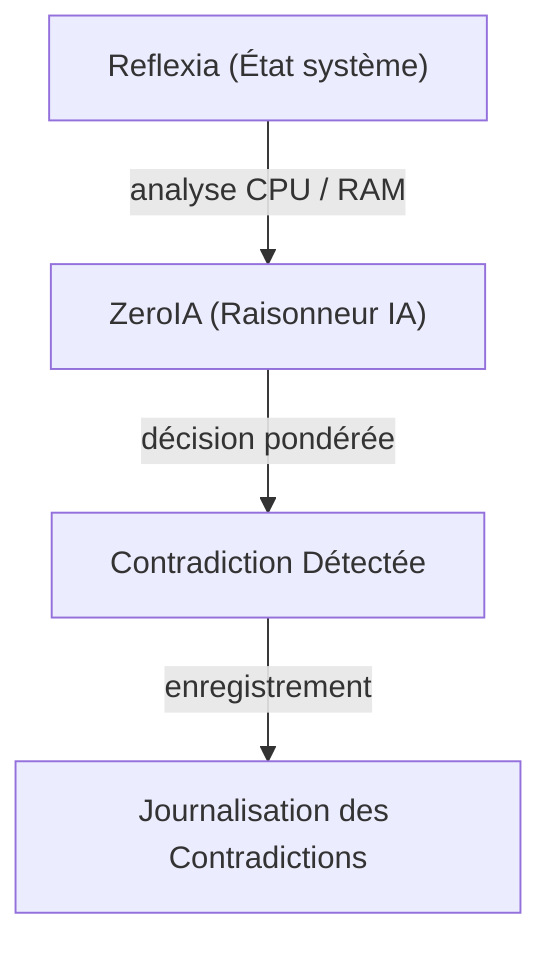
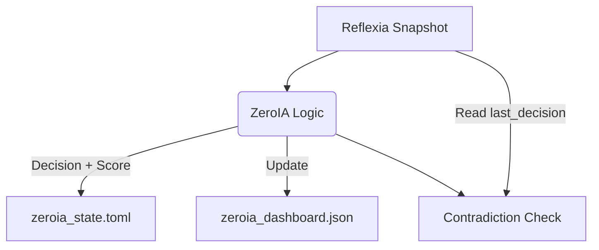

# 🧠 ZeroIA — Module de Décision Contextuelle


ZeroIA est un module conçu pour prendre des décisions basées sur le contexte du système, en particulier l'utilisation du CPU. Ce document décrit sa structure, son fonctionnement, et son intégration avec ReflexIA.

---

## 📂 Structure du Module

Le module ZeroIA est structuré comme suit :

```
arkalia-luna-pro/
└── modules/
    └── zeroia/
        ├── __init__.py
        ├── core.py
        ├── reason_loop.py
        ├── config/
        │   └── weights.toml
        ├── state/
        │   └── zeroia_state.toml
        ├── logs/
        │   └── zeroia.log
        ├── tests/
        │   └── test_zeroia_decision_basic.py
```

---

## 🛠 Fonctionnement Interne

ZeroIA fonctionne en trois étapes principales :

1. **Chargement du Contexte** : Le contexte est chargé à partir d'un fichier TOML.
2. **Prise de Décision** : En fonction de l'utilisation du CPU, ZeroIA décide de réduire la charge, de surveiller, ou de rester en mode normal.
3. **Journalisation** : Les décisions sont enregistrées dans un fichier log et l'état est mis à jour dans un fichier TOML.

### Exemple de Code

Voici un exemple de code pour ZeroIA :

```python
import toml
from datetime import datetime
from pathlib import Path

CTX_PATH = Path("state/global_context.toml")
LOG_PATH = Path("modules/zeroia/logs/zeroia.log")
STATE_PATH = Path("modules/zeroia/state/zeroia_state.toml")

def load_context():
    return toml.load(CTX_PATH)

def decide(context):
    cpu = context["status"]["cpu"]
    if cpu > 80:
        return "reduce_load"
    elif cpu > 60:
        return "monitor"
    else:
        return "normal"

def log_decision(decision):
    LOG_PATH.parent.mkdir(parents=True, exist_ok=True)
    with open(LOG_PATH, "a") as f:
        f.write(f"{datetime.now()} :: DECISION = {decision}\n")

    STATE_PATH.parent.mkdir(parents=True, exist_ok=True)
    with open(STATE_PATH, "w") as f:
        toml.dump({"last_decision": decision, "timestamp": str(datetime.now())}, f)

def main():
    ctx = load_context()
    decision = decide(ctx)
    log_decision(decision)
    print(f"ZeroIA decided: {decision}")

if __name__ == "__main__":
    main()
```

---

## 🧪 Tests

Les tests pour ZeroIA sont validés avec Pytest, assurant que les décisions sont prises correctement en fonction de différents scénarios d'utilisation du CPU.

---

## 🔄 Intégration avec ReflexIA

ZeroIA est maintenant capable de s'intégrer avec ReflexIA pour obtenir un contexte plus riche. Cela permet à ZeroIA de prendre des décisions plus informées en utilisant les données de ReflexIA.

### Fonctionnement de l'Intégration

- **Lecture du Contexte ReflexIA** : ZeroIA lit les données de `reflexia_state.toml` pour enrichir son contexte.
- **Fusion des Contextes** : Les données de ReflexIA sont fusionnées avec le contexte existant de ZeroIA.
- **Prise de Décision Améliorée** : La fonction `decide()` a été étendue pour prendre en compte les alertes de ReflexIA, telles que la sévérité des alertes.

### Exemple de Journalisation

Les décisions prises par ZeroIA sont maintenant journalisées avec des informations supplémentaires provenant de ReflexIA. Voici un exemple de log :

```
2025-06-24 20:43:48.758557 :: FROM REFLEXIA: {'last_snapshot': '⚠️ RAM élevée', 'last_decision': 'monitor'} | CPU=72.1 | SEVERITY=warning → DECISION = monitor
```

---

## 🧪 Tests

Les tests pour l'intégration avec ReflexIA ont été ajoutés et validés avec Pytest, assurant que les décisions sont prises correctement en fonction des données enrichies.

---

## 🧠 Fiche Cognitive

La fiche cognitive de ZeroIA décrit comment le système utilise les données contextuelles pour prendre des décisions éclairées. ZeroIA intègre les informations de ReflexIA pour améliorer la précision et la pertinence de ses décisions.

### Schéma de Fonctionnement

Voici un schéma illustrant le processus d'intégration de ZeroIA avec ReflexIA :



---

## 🔄 Logique et Heuristiques

ZeroIA utilise une logique basée sur des heuristiques pour prendre des décisions en fonction du contexte système. Les décisions sont influencées par l'utilisation du CPU, la sévérité des alertes, et les données fournies par Reflexia.

### Seuils et Scores

- **Seuils de CPU** :
  - Réduire la charge si CPU > 80%
  - Surveiller si CPU > 60%
  - Normal si CPU <= 60%

- **Scores de Confiance** :
  - 1.0 pour arrêt d'urgence
  - 0.8 pour réduction de charge
  - 0.6 pour surveillance
  - 0.4 pour mode normal

### Diagramme Mermaid



Ce diagramme illustre comment ZeroIA intègre les données de Reflexia pour améliorer la précision de ses décisions.

### Heuristiques

ZeroIA ajuste dynamiquement ses seuils de décision en fonction des actions récentes, comme indiqué par la fonction `should_lower_cpu_threshold`.

---

## 🔄 Dernière décision

- Décision : `monitor`
- Confiance : `0.6`
- Justification : `cpu=72.1, severity=warning`

---

## 📊 Pondération IA

- Score moyen : **0.65**
- Décisions majeures : `reduce_load`, `monitor`, `normal`

---

## 🧠 Diagramme d'Interaction (Mermaid)



---

## 🧠 Chaîne de Raisonnement (Mermaid)



---

## 🔄 Contradiction ReflexIA

ZeroIA gère les contradictions avec ReflexIA en comparant les décisions prises par les deux systèmes. Si une contradiction est détectée, elle est journalisée pour analyse.

## 📄 TOML + JSON Générés

ZeroIA génère des fichiers TOML et JSON pour stocker les décisions et les états. Voici un exemple de fichier TOML généré :

```toml
[decision]
last_decision = "reduce_load"
confidence_score = 0.75
justification = "cpu=72.1, severity=warning"
```

## 📜 Logs

Les logs de ZeroIA fournissent des informations détaillées sur les décisions prises et les états du système. Voici un exemple de log :

```
2025-06-24 20:43:48.758557 :: FROM REFLEXIA: {'last_snapshot': '⚠️ RAM élevée', 'last_decision': 'monitor'} | CPU=72.1 | SEVERITY=warning → DECISION = monitor
```

## 🩺 Healthcheck

Le script de healthcheck vérifie l'état de ZeroIA en s'assurant que la dernière décision est valide. Si une décision est présente, le script retourne "OK".

## 🐳 Commandes Docker Utiles

Voici quelques commandes Docker utiles pour gérer ZeroIA :

- `docker exec -it zeroia bash` : Accéder au shell du conteneur ZeroIA.
- `docker logs zeroia` : Voir les logs de ZeroIA.
- `docker restart zeroia` : Redémarrer le conteneur ZeroIA.

© 2025 **Athalia** – Tous droits réservés.
🤖 Powered by Arkalia ReflexIA `v1.x`
