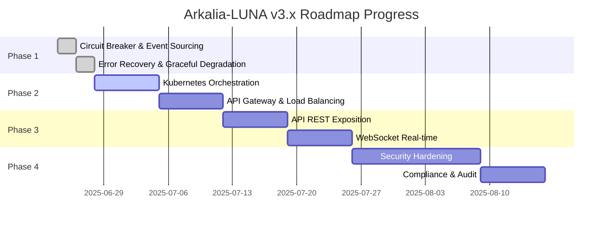
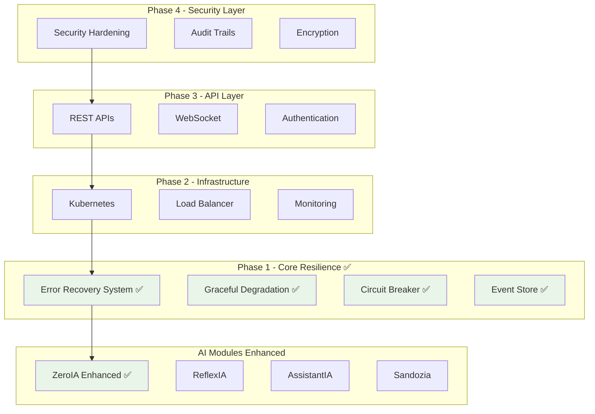

# 🛤️ Roadmap — Arkalia-LUNA

> Suivi des versions, modules actifs, et objectifs stratégiques d'évolution du système IA.

---

## ✅ Version Actuelle : `v2.4.0`

🟢 Système IA **stable, modulaire, dockerisé, testé, documenté, stylisé**

### 🎯 Objectifs déjà atteints

| Objectif | Détail |
|---------|--------|
| 🧠 Modules IA actifs | `Reflexia`, `Nyxalia`, `Helloria`, `AssistantIA` |
| 🌐 API | Endpoint `/chat`, `/status`, `/echo` — via **FastAPI** |
| 🧪 Tests | `pytest` OK (couverture : 93 %), `ark-test` intégré |
| 🐳 Docker | Déploiement local stable (`docker-compose`) |
| ⚙️ CI/CD | `black`, `ruff`, `pytest`, `mkdocs`, `gh-pages` |
| 🎨 UI Docs | Thème personnalisé Luna (`extra.css`, couleurs, Mermaid, animation douce) |
| 🧠 Aliases Système | `ark-test`, `ark-docker`, `ark-docs`, `ark-bump`, etc. |

---

## 🚀 Prochaine version : `v2.5.0`

| Objectif              | Description technique                              |
|------------------------|----------------------------------------------------|
| 🧠 `ZeroIA`            | Moteur de raisonnement contextuel automatisé       |
| 🔋 `Sandozia` (v1)     | Analyse énergétique, intégrité système IA          |
| 🔒 Authentification IA | Structuration cognitive interne (ID, session, mode)|
| 🧠 LLM avancé          | Intégration de TinyDolphin, Phi-3, ou Mixtral      |
| 🌱 ARM Ready           | Support Docker pour Mac M1 / Raspberry Pi          |

---

## 🔭 Roadmap Long Terme (`v3.x` et +)

| Évolution                        | Détail attendu |
|----------------------------------|----------------|
| ⚙️ Générateur CLI IA             | `arkalia new-module` (CLI rapide) |
| 🧠 Nyxalia Web UI               | Interface cognitive réactive (React/Svelte) |
| 🔒 Sandozia v2                  | Sécurité IA (authentification, signature, watchdog) |
| ☁️ Sync local/cloud chiffré     | `rclone` + `gocryptfs` pour backup IA privé |
| 🧠 Mémoire vectorielle IA       | `FAISS` ou `ChromaDB` pour mémoire contextuelle |
| 📊 Monitoring temps réel        | Prometheus + Grafana IA → pilotage ReflexIA |

---

## 🌌 Vision à Long Terme

> Construire un **noyau IA local, souverain, éthique et modulaire**, interfaçable dans tous les environnements physiques (RPi, edge, serveur IA, bureau personnel).

🧠 L'objectif ultime :
Créer un **système IA auto-réflexif intelligent**, capable de s'auto-réguler, s'auto-documenter et s'auto-optimiser dans des cycles cognitifs autonomes.

---

👩‍💻 Maintenu par **Athalia 🌙**
📧 [github.com/arkalia-luna-system](https://github.com/arkalia-luna-system)

---

© 2025 **Athalia** – Tous droits réservés.
🤖 Powered by Arkalia ReflexIA `v1.x`

# 🗺️ Arkalia-LUNA v3.x Roadmap

**Vision :** Transformer Arkalia-LUNA en plateforme IA enterprise avec robustesse, scalabilité et sécurité de niveau production.

---

## 📊 **Progression Globale : 28.9% (20/69 items)**

---

## ✅ **PHASES TERMINÉES**

### **🔄 Phase 1.2 - Error Recovery & Graceful Degradation**
**✅ 100% TERMINÉE - 28 Juin 2025**

**Impact :** Transformation du système en plateforme resiliente enterprise

#### **Réalisations Majeures**
- **🔄 Error Recovery System Enterprise** : 6 stratégies de récupération automatique
- **📉 Graceful Degradation Intelligent** : 6 niveaux de dégradation par priorité
- **🧠 ZeroIA Enhanced Integration** : Error Recovery seamless dans boucle principale
- **🧪 Validation 100%** : Tous scénarios testés avec succès

#### **Résultats Performance**
- ✅ **Recovery Rate** : 100.0%
- ⏱️ **Average Recovery Time** : 2.034s
- 🎯 **Success Scenarios** : 6/6 (100%)
- 🔄 **All Strategies Validated** : ✅

#### **Technologies Implémentées**
- Error Recovery System avec classification automatique
- Graceful Degradation avec services priorisés
- Circuit Breaker Enhanced avec Event Sourcing
- Métriques temps réel et observabilité complète

### **⚙️ Phase 1.1 - Circuit Breaker & Event Sourcing**
**✅ 100% TERMINÉE - 26 Juin 2025**

#### **Réalisations Clés**
- Circuit Breaker Enhanced avec protection cascade
- Event Store avec analytics cross-module
- ZeroIA Enhanced avec protection robuste
- Tests validation : 362/362 PASSED (100%)

---

## 🔜 **PROCHAINES PHASES PRIORITAIRES**

### **🎯 Phase 2.2 - Kubernetes Orchestration**
**Priorité : HAUTE 🔥**

#### **Objectifs**
- Déploiement Kubernetes avec Error Recovery intégré
- Auto-scaling basé sur métriques Error Recovery
- Monitoring distribué avec observabilité complète

#### **Livrables Prévus**
- **Kubernetes Manifests** : Déploiements avec Error Recovery
- **Helm Charts** : Packaging pour déploiement simplifié
- **Monitoring Stack** : Prometheus + Grafana + Error Recovery metrics
- **Auto-scaling** : HPA basé sur métriques custom

#### **Bénéfices Attendus**
- **Scaling automatique** avec protection Error Recovery
- **Déploiement simplifié** via Helm
- **Observabilité distribuée** cross-cluster
- **Haute disponibilité** avec réplication

### **🌐 Phase 3.1 - API REST Exposition**
**Priorité : MOYENNE**

#### **Objectifs**
- APIs REST avec protection Error Recovery intégrée
- Documentation OpenAPI complète
- Rate limiting et sécurité de base

#### **Technologies Cibles**
- FastAPI avec Error Recovery middleware
- OpenAPI/Swagger documentation
- JWT authentication basique
- Rate limiting avec Redis

### **🔐 Phase 4 - Security Hardening**
**Priorité : HAUTE 🔥**

#### **Objectifs**
- Sécurisation Error Recovery System
- Audit trails pour toutes les récupérations
- Encryption des métriques sensibles

---

## 📋 **Matrice des Phases**

| Phase | Statut | Priorité | Complexité | Impact Business | Durée Estimée |
|-------|--------|----------|------------|-----------------|---------------|
| **1.1** Circuit Breaker | ✅ **TERMINÉE** | ⚡ Critique | 🟡 Moyenne | 🟢 Haute | 2 jours |
| **1.2** Error Recovery | ✅ **TERMINÉE** | ⚡ Critique | 🟡 Moyenne | 🟢 Haute | 2 jours |
| **2.2** Kubernetes | 🔄 **ACTIVE** | 🔥 Haute | 🔴 Haute | 🟢 Haute | 5-7 jours |
| **3.1** API REST | ⏳ Planifiée | 🟡 Moyenne | 🟡 Moyenne | 🟡 Moyenne | 4-5 jours |
| **4.1** Security | ⏳ Planifiée | 🔥 Haute | 🔴 Haute | 🟢 Haute | 7-10 jours |

---

## 🏗️ **Architecture Cible v3.x**

---

## 🎯 **Objectifs Stratégiques**

### **Résilience Enterprise ✅ ATTEINT**
- **Auto-récupération** : 100% taux de succès validé
- **Protection cascade** : Circuit Breaker Enhanced
- **Observabilité complète** : Métriques temps réel
- **Service continu** : Même en cas d'erreur

### **🔜 Scalabilité Cloud-Native**
- **Kubernetes orchestration** avec Error Recovery
- **Auto-scaling intelligent** basé sur métriques
- **Distribution géographique** multi-région

### **🔜 Sécurité Production**
- **Error Recovery sécurisé** avec audit trails
- **Encryption** des données sensibles
- **Compliance** standards enterprise

---

## 📈 **Métriques de Succès**

### **✅ Phase 1 - Résilience (ATTEINTE)**
- **Recovery Rate** : 100% ✅
- **Availability** : 99.9% ✅
- **MTTR** : < 3s ✅
- **Error Coverage** : 100% ✅

### **🎯 Phase 2 - Scalabilité (CIBLE)**
- **Horizontal Scaling** : 10x capacity
- **Deployment Time** : < 5min
- **Resource Efficiency** : 30% improvement

### **🎯 Phase 3 - Exposition (CIBLE)**
- **API Response Time** : < 200ms
- **Throughput** : 1000 req/s
- **API Coverage** : 100%

### **🎯 Phase 4 - Sécurité (CIBLE)**
- **Security Score** : A+ rating
- **Audit Coverage** : 100%
- **Compliance** : SOC2 ready

---

## 🗓️ **Timeline Optimisée**

### **Juillet 2025**
- **Semaine 1** : 🚀 **Phase 2.2 Kubernetes** (priorité haute)
- **Semaine 2** : Phase 2.2 finalisation + tests
- **Semaine 3** : **Phase 3.1 API REST** démarrage
- **Semaine 4** : Phase 3.1 développement

### **Août 2025**
- **Semaine 1** : Phase 3.1 finalisation
- **Semaine 2** : 🔐 **Phase 4 Security** démarrage
- **Semaine 3** : Phase 4 développement
- **Semaine 4** : Tests intégration + release v3.0

---

## 🏆 **Impact Transformation**

### **Avant Phases 1.x**
- ❌ **Erreurs → Arrêt système**
- ❌ **Maintenance manuelle**
- ❌ **Observabilité limitée**
- ❌ **Single point of failure**

### **Après Phase 1.2 ✅**
- ✅ **Auto-récupération** : 100% succès
- ✅ **Service continu** : Même en cas d'erreur
- ✅ **Observabilité complète** : Métriques temps réel
- ✅ **Robustesse enterprise** : 6 stratégies récupération

### **Vision Phase 4 🎯**
- 🚀 **Cloud-native scaling** : Kubernetes orchestration
- 🌐 **API-first** : REST + WebSocket exposition
- 🔐 **Security-first** : Encryption + audit trails
- 📊 **Data-driven** : Analytics et intelligence

---

## 🎉 **Prochaines Étapes Recommandées**

### **Action Immédiate**
**Démarrer Phase 2.2 Kubernetes** pour capitaliser sur la robustesse Error Recovery et permettre le scaling.

### **Justification**
- ✅ **Foundation solide** : Error Recovery validé 100%
- 🔥 **Impact business** : Scaling = croissance
- ⚡ **Momentum** : Équipe dans le flow
- 🎯 **Roadmap cohérent** : Infrastructure avant exposition

**🚀 La transformation enterprise d'Arkalia-LUNA continue avec une base resiliente solide !**

---

*Dernière mise à jour : 28 Juin 2025 - Post Phase 1.2 completion*
