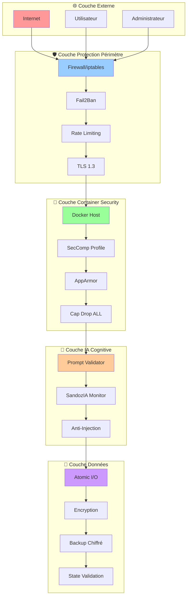
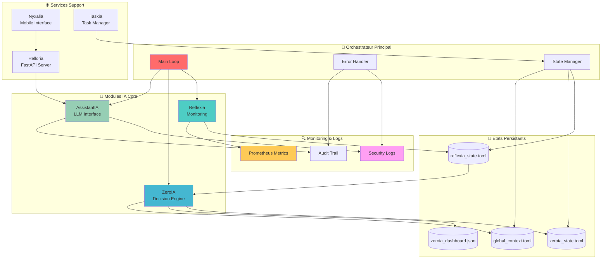
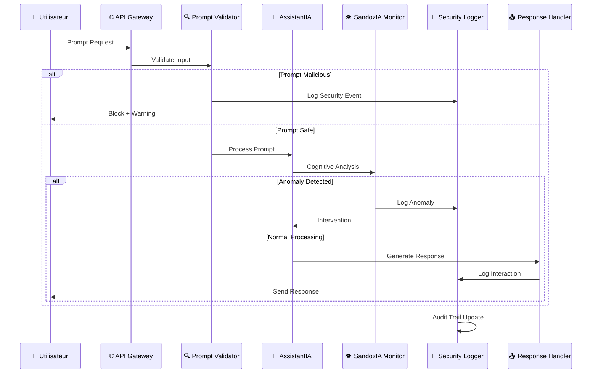
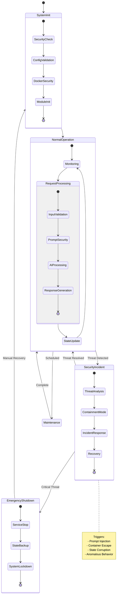
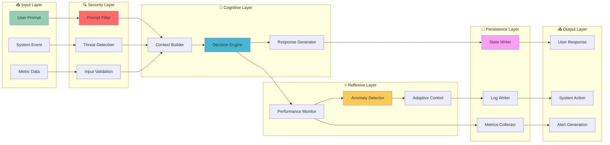
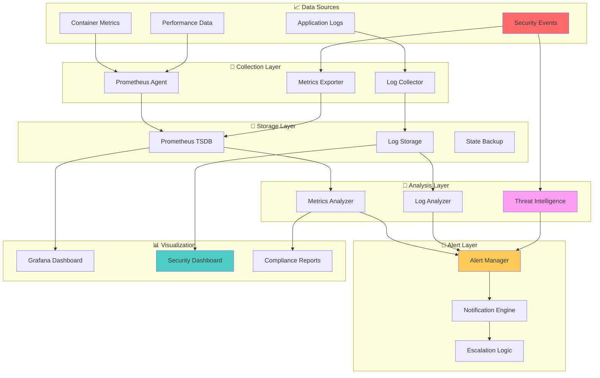

# 🏗️ Architecture Sécurité Arkalia-LUNA

## 🔒 Vue d'Ensemble Sécurité Multi-Couches



## 🚀 Flux Modules IA et États



## 🔐 Flux Sécurité et Validation



## 🏗️ Architecture Containers et Réseaux

```mermaid
graph TB
    subgraph "🖥️ Host System"
        HostOS[Host OS]
        DockerDaemon[Docker Daemon]
        HostNetwork[Host Network]
    end

    subgraph "🐳 Docker Network"
        ArkaliaNetwork[arkalia-network<br/>bridge]
        PrometheusNetwork[monitoring<br/>internal]
    end

    subgraph "📦 Core Containers"
        APIContainer[arkalia-api (port 8000)<br/>:8000]
        ReflexiaContainer[reflexia<br/>internal]
        ZeroiaContainer[zeroia<br/>internal]
    end

    subgraph "🧠 AI Containers"
        AssistantiaContainer[assistantia<br/>internal]
        OllamaContainer[ollama<br/>:11434]
    end

    subgraph "📊 Monitoring Stack"
        PrometheusContainer[prometheus<br/>:9090]
        MetricsContainer[arkalia-metrics<br/>:8001]
    end

    subgraph "💾 Data Volumes"
        StateVolume[States Volume<br/>RW]
        LogsVolume[Logs Volume<br/>RW]
        ModelsVolume[Models Volume<br/>RO]
        BackupVolume[Backup Volume<br/>encrypted]
    end

    HostOS --> DockerDaemon
    DockerDaemon --> ArkaliaNetwork
    DockerDaemon --> PrometheusNetwork

    ArkaliaNetwork --> APIContainer
    ArkaliaNetwork --> ReflexiaContainer
    ArkaliaNetwork --> ZeroiaContainer
    ArkaliaNetwork --> AssistantiaContainer
    ArkaliaNetwork --> OllamaContainer

    PrometheusNetwork --> PrometheusContainer
    PrometheusNetwork --> MetricsContainer

    APIContainer --> StateVolume
    ReflexiaContainer --> StateVolume
    ZeroiaContainer --> StateVolume

    APIContainer --> LogsVolume
    AssistantiaContainer --> LogsVolume

    OllamaContainer --> ModelsVolume

    StateVolume --> BackupVolume
    LogsVolume --> BackupVolume

    HostNetwork --> APIContainer

    style HostOS fill:#333,color:#fff
    style ArkaliaNetwork fill:#4ecdc4
    style APIContainer fill:#ff6b6b
    style StateVolume fill:#feca57
    style BackupVolume fill:#ff9ff3
```

## 🔄 États et Transitions Sécurité



## 🧠 Flux Cognitif IA et Décisions



## 📊 Monitoring et Métriques Sécurité



---

*Diagrammes maintenus par Arkalia-LUNA Architecture Team — Version sécurité renforcée*
*🏗️ "Architecture défensive, sécurité par conception" — Arkalia Security Design*

sequenceDiagram
    participant Z as ZeroIA
    participant S as Sandozia
    participant C as CognitiveReactor
    participant V as CrossValidator
    participant R as Reflexia
    participant E as ErrorRecovery
    participant T as Chronalia
    participant M as Monitoring

    Note over Z,M: Cycle de décision standard
    Z->>S: Détection pattern
    S->>C: Analyse pattern
    C->>V: Demande validation
    V->>R: Vérification cohérence
    R-->>E: Si erreur détectée
    E-->>Z: Recovery si nécessaire

    par Flux parallèles
        Z->>M: Métriques décision
    and
        S->>M: Métriques pattern
    and
        R->>M: Métriques système
    end

    T->>M: Archivage timeline

    Note over Z,M: Boucle cognitive complète
