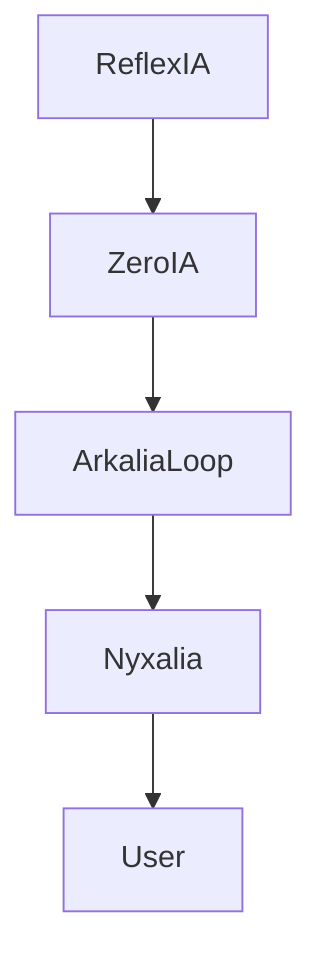

# 🧬 Structure du noyau Arkalia-LUNA

## Racine :
- `/core/` → logique commune
- `/modules/` → modules IA isolés
- `/config/` → fichiers `.toml`, `.json`, etc.
- `/logs/`, `/state/`, `/utils/`

## Devstation :
- Git propre avec tags + CI
- Docker + mkdocs + tests

```
arkalia-luna-pro/
├── core/        # Logique commune transversale
├── modules/     # Modules IA isolés et autonomes
├── config/      # Fichiers .toml / .json centralisés
├── logs/        # Journaux d'activité et exécution
├── state/       # États persistants (internes / cognitifs)
├── utils/       # Fonctions techniques internes partagées
├── tests/       # Tests unitaires (pytest)
├── docs/        # Documentation MkDocs
└── scripts/     # Scripts automatisés (build, test, Docker)
```

## 🧪 Devstation IA Professionnelle

Ta Devstation actuelle est un environnement de production IA local, avec les composants suivants :

| Composant     | Statut | Détail |
|---------------|--------|--------|
| 🔀 Git        | ✅ Propre avec tags, branches, bumpver |
| 🧪 Tests      | ✅ pytest + pytest-cov, 100% couverture |
| 🧼 Qualité code | ✅ pre-commit actif (black, ruff) |
| 🐳 Docker     | ✅ Dockerfile + docker-compose stables |
| 🌍 API        | ✅ FastAPI + Uvicorn local fonctionnel |
| 📘 Docs       | ✅ MkDocs auto-publiée (gh-pages) |
| 🚦 CI/CD      | ✅ GitHub Actions (tests, lint, deploy) |

## 🧠 Objectifs visés
- 💡 Zéro dette technique
- 🔁 Modules IA indépendants et orchestrables
- 🛰 Déploiement local rapide & versionné
- 🧩 Interopérabilité entre sous-systèmes (Reflexia, ZeroIA, etc.)

## Noyau Arkalia

Le noyau d'Arkalia est composé du kernel et de la devstation, qui ensemble fournissent une base robuste pour le développement et l'exécution des applications.

## 🔁 Structure dynamique (Mermaid)



## Exemples de Blocs

### Bloc Mermaid


### Bloc Tabbed Markdown

```markdown
=== "Python"
    ```python
    print("Hello, Arkalia-LUNA!")
    ```

=== "JavaScript"
    ```javascript
    console.log("Hello, Arkalia-LUNA!");
    ```
``` 