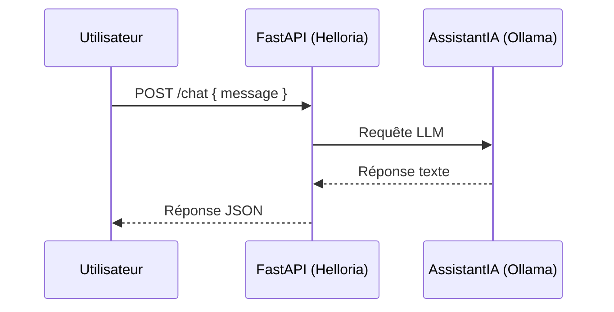

# 🧠 Utilisation d’Arkalia-LUNA

Ce guide présente **comment interagir avec le système IA Arkalia-LUNA** via les endpoints FastAPI exposés localement. Il s'adresse aux développeurs, testeurs ou utilisateurs externes souhaitant dialoguer avec l'IA, surveiller son état ou intégrer ses fonctions.

---

## 🚀 Lancement rapide du système

### 📦 En local (Uvicorn)

```bash
uvicorn modules.helloria.core:app --reload
```

🐳 En mode Docker

```bash
docker-compose up --build
```

🧠 Via alias terminal

- `ark-run`         # Lancement IA local
- `ark-docker`      # Build & run docker
- `ark-test`        # Tests unitaires + couverture

🌐 Endpoints API principaux

🔎 GET /status

Retourne l’état du système Arkalia.

```bash
curl -X GET http://localhost:8000/status
```

📥 Réponse type :

```json
{
  "status": "online",
  "modules": ["Reflexia", "Nyxalia", "AssistantIA"]
}
```

🗣️ POST /chat

Permet d’envoyer une requête à l’IA locale via AssistantIA (Ollama).

```bash
curl -X POST http://localhost:8000/chat \
  -H "Content-Type: application/json" \
  -d '{"message": "Quelle est la philosophie d’Arkalia ?"}'
```

📥 Réponse type :

```json
{
  "response": "Tu as dit : Quelle est la philosophie d’Arkalia ?"
}
```

ℹ️ La réponse dépend du modèle LLM actif (Ollama : mistral, llama2, etc.)

⸻

📋 Paramètres avancés (à venir)

Le corps de requête /chat supportera bientôt :

| Champ    | Type   | Description                        |
|----------|--------|------------------------------------|
| message  | string | Prompt envoyé à l’IA               |
| user_id  | string | Identifiant utilisateur (personnalisation) |
| lang     | string | Langue de réponse attendue (fr, en, etc.) |
| mode     | string | Mode de raisonnement (neutre, empathique…)|

🧠 Diagramme d’appel API (Mermaid)



📎 Notes
- Le port par défaut est 8000 (modifiable dans docker-compose.yml)
- L’endpoint /chat est exposé par le module assistantia
- Toute interaction est loggée dans logs/ (si activé)

⸻

🧭 Prochaines évolutions
- Authentification API (token, user_id)
- Historique conversationnel stocké
- Mode debug IA interactif (debug_mode = true)

⸻

👩‍💻 Maintenu par Athalia 🌙 — github.com/arkalia-luna-system
