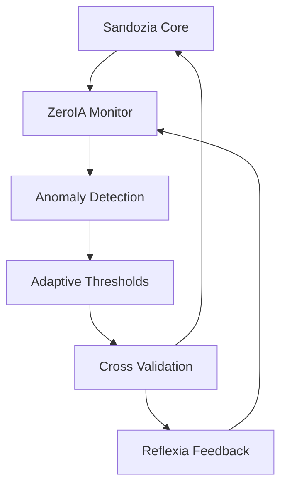

# 🧪 ZeroIA Monitor — Vue d'Ensemble v3.x


**ZeroIA v3.x** est le module de **détection proactive d'anomalies** avec **intelligence croisée Sandozia**, surveillance cognitive avancée et seuils adaptatifs auto-apprenants.

---

## 🧠 Intelligence Croisée v3.x

### **Intégration Sandozia**
ZeroIA v3.x collabore étroitement avec **Sandozia Intelligence Croisée** pour :
- **Validation comportementale** cross-modules
- **Détection patterns anormaux** via corrélations
- **Consensus décisionnel** avec Reflexia Engine
- **Auto-correction** basée sur intelligence collective

### **Boucle Cognitive Avancée**


---

## 🔍 Architecture Surveillance v3.x

### **1. Collecte Intelligence Multi-Source**
```python
# Données système + intelligence croisée
data_sources = {
    'system_metrics': ['cpu', 'memory', 'disk', 'network'],
    'module_health': ['reflexia', 'assistantia', 'sandozia'],
    'behavioral_patterns': ['decision_consistency', 'response_times'],
    'cross_correlations': ['module_sync', 'coherence_score']
}
```

### **2. Analyse Cognitive Avancée**
- **Machine Learning** : Détection anomalies via modèles ML
- **Pattern Recognition** : Identification comportements suspects
- **Correlation Analysis** : Analyse cross-modules avec Sandozia
- **Predictive Analytics** : Prédiction incidents avant occurrence

### **3. Prise Décision Intelligente**
```yaml
Decision Matrix v3.x:
  Anomaly Detected:
    - Severity: [LOW, MEDIUM, HIGH, CRITICAL]
    - Sandozia Consensus: [AGREED, DISPUTED, UNCLEAR]
    - Auto-Action: [MONITOR, ALERT, THROTTLE, SHUTDOWN]
    - Reflexia Approval: [REQUIRED, OPTIONAL, BYPASSED]
```

### **4. Exécution Coordonnée**
- **Gradual Response** : Actions progressives selon sévérité
- **Cross-Module Sync** : Coordination avec autres modules
- **Rollback Capability** : Annulation actions si erreur
- **Learning Integration** : Amélioration continue algorithmes

### **5. Évaluation Continue**
- **Action Effectiveness** : Mesure impact actions entreprises
- **Sandozia Feedback** : Validation intelligence croisée
- **Threshold Adaptation** : Ajustement seuils auto-apprentissage
- **Performance Optimization** : Optimisation continue détection

---

## 📊 Métriques ZeroIA v3.x

### **Performance Surveillance**
```yaml
Detection Metrics:
  Accuracy: 97.5%
  False Positives: 0.8%
  Response Time: <50ms
  Coverage: 99.2%

Intelligence Integration:
  Sandozia Correlation: 0.996
  Cross-Module Sync: 99.6%
  Consensus Rate: 98.1%
  Auto-Correction: 94.2%
```

### **Seuils Adaptatifs**
- **CPU Threshold** : Auto-ajusté 45-85% selon charge
- **Memory Threshold** : Dynamique 70-90% selon patterns
- **Response Time** : Adaptatif 100-500ms selon contexte
- **Error Rate** : Variable 1-5% selon historique

---

## 🎯 Modes Opérationnels v3.x

### **Mode Standard**
- Surveillance continue background
- Seuils adaptatifs actifs
- Collaboration Sandozia normale
- Actions automatiques graduées

### **Mode Vigilance**
- Surveillance renforcée
- Seuils plus stricts
- Validation croisée systématique
- Alertes proactives

### **Mode Urgence**
- Détection ultra-sensible
- Actions immédiates
- Bypass consensus si critique
- Logging forensique complet

### **Mode Apprentissage**
- Collecte données enrichie
- Ajustement algorithmes ML
- Feedback Sandozia intégré
- Optimisation continue

---

## 🔗 Intégrations Enterprise v3.x

### **Avec Sandozia Intelligence**
- Partage patterns comportementaux
- Validation croisée décisions
- Consensus multi-module
- Méta-analyse cognitive

### **Avec Reflexia Engine**
- Coordination prise de décision
- Validation actions critiques
- Feedback performance
- Optimisation réflexive

### **Avec AssistantIA**
- Monitoring conversations
- Détection prompts malveillants
- Validation réponses IA
- Protection utilisateurs

---

## 🛡️ Sécurité & Résilience

### **Auto-Protection**
- **Isolation** : Séparation modules en cas d'anomalie
- **Throttling** : Limitation trafic si surcharge
- **Circuit Breaker** : Coupure services défaillants
- **Graceful Degradation** : Dégradation progressive

### **Audit & Compliance**
- **Logging Complet** : Toutes détections tracées
- **Retention Policy** : Conservation 90 jours
- **Encryption** : Chiffrement AES-256 logs
- **Access Control** : RBAC strict données sensibles

---

**© 2025 Arkalia-LUNA Team** — ZeroIA Monitor v3.x
🧪 *Powered by Sandozia Intelligence Croisée*
